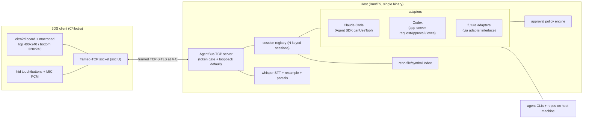
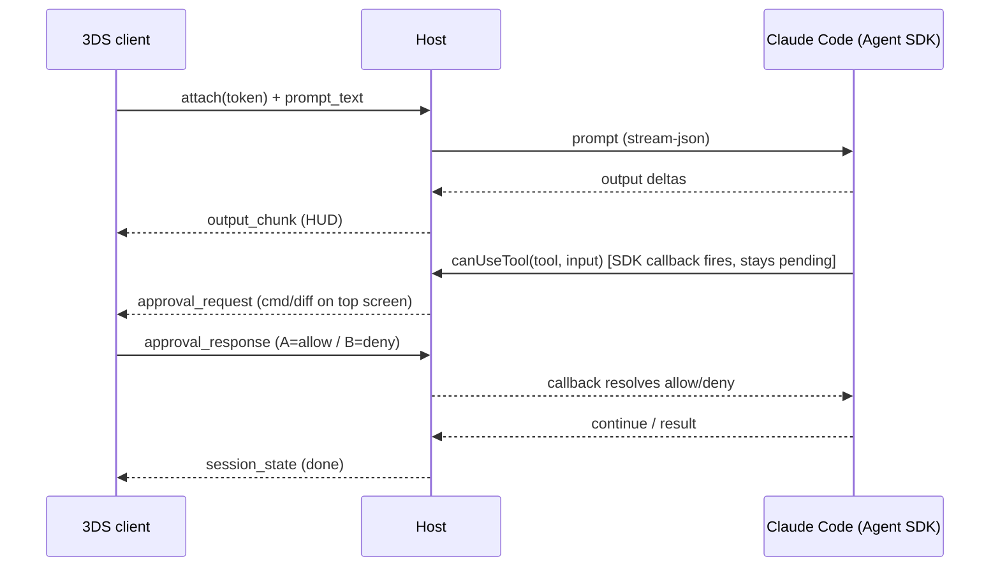

# feat: 3DS Multi-Agent Vibe-Coding Controller

> **This doc is the build tracker.** The Build Status section below is kept current as work lands. Legend: ✅ done + tested · 🟡 partial · ⬜ not started.

> **Direction update (plan-003):** the product pivoted to a **remote tmux terminal + macropad** (see `docs/plans/2026-07-01-003-feat-3ds-tmux-terminal-macropad-plan.md`). Terminal mode — a raw tmux pane streamed over the encrypted transport — is now the primary device experience; the structured agent-adapter stack below (Claude/Codex normalizers, approval policy, capability negotiation) is retained but off the primary path as a possible future "structured mode."

## Build Status

**Snapshot (2026-07-02):** Host + protocol green (**185 tests, typecheck clean**). Real Codex loop proven end-to-end — now **over the encrypted transport with zero-config discovery** (XChaCha20-Poly1305 PSK, ported from onoSendai's design; see `docs/plans/2026-07-01-002-feat-encrypted-transport-discovery-plan.md` and `docs/PROTOCOL.md`). CI added (bun check + C KAT + devkitARM build). The 3DS client **compiles** to a `.3dsx` but is **not yet runtime-verified on hardware**. Voice, on-device multi-agent tiles, and live A/B approvals remain.

**By milestone:** M1 ~90% (host done + proven; device compiles, awaiting first hardware run) · M2 ~60% (host done incl. AE2 e2e; device tiles + live approvals pending) · M3 ~40% (host audio done; device mic/PTT + S1 spike pending) · M4 ~85% (token auth + deployable binary + durable replay + transport encryption + zero-config discovery done; pairing UX + on-device hardware verification pending).

| Unit | Status | Notes |
|---|---|---|
| U1 scaffold | ✅ | Bun workspace + protocol; client `.3dsx` builds via devkitPro Docker |
| U2 AgentBus protocol | ✅ | codec + golden wire vectors + codegen parity; session-id + auth-token reserved in envelope |
| U3 server + token gate | ✅ | real-socket integration test; token auth, loopback-default bind, backpressure |
| U4 Claude adapter | 🟡 | built as **CLI** (`claude -p` stream-json, not the SDK) + hermetic tests; streaming only, live approval not wired; real-claude run needs an authed host |
| U5 client skeleton + M1 loop | 🟡 | compiles; connect/prompt/stream/approve-deck + **auto-reconnect** + HUD; runtime unverified on hardware |
| U6 M1 e2e | ✅ | host-side e2e + real Codex loop proven on the Mac |
| U7 registry + session_list | ✅ | N-session registry, routing, session_list; tested |
| U8 capability + macropad emitter | ✅ | capability negotiation + host-side state→layout emitter; tested |
| U9 Codex adapter | 🟡 | built as **`codex exec --json`** (streaming/allowlist) + tests + real e2e; `app-server` live-approval path not wired |
| U12 approval policy | ✅ | classify + escalate, fail-safe; tested (not yet exercised with live approvals) |
| U13 client board + macropad | 🟡 | single-session HUD done; multi-tile board + tap-to-focus not wired on device |
| U14 audio resample + STT | ✅ | 16364→16000 resample + STT interface + ingest; tested (FakeStt; real whisper not integrated) |
| U15 client push-to-talk | ⬜ | on-device mic capture not built |
| U16 repo-grounded disambiguation | ✅ | repo index + fuzzy match → macropad candidates; tested (AE3) |
| U17 deployable binary | ✅ | `bun build --compile` single binary; boots + serves (verified) |
| U18 durable sessions + replay | ✅ | ring buffer + replay-since-cursor + overflow marker; e2e (AE1) |
| U19 pairing + encryption | 🟡 | token auth (R20a) + transport encryption (R20b, XChaCha20-Poly1305 PSK — plan 002 U23–U27) done; pairing UX (on-device key mint/display) not built |
| U20 layouts + intent macros | ✅ | `.pad` load + intent resolution; tested (not wired to device UI) |
| U21 recordable routines | ✅ | record/replay + (de)serialize; tested |
| U22 transcript + STT corpus | ✅ | structured log + bias-list extraction; tested |
| U23 M2 e2e (AE2) | ✅ | concurrent multi-agent approval routing over a real socket; tested |
| S1 voice-over-802.11g spike | ⬜ | needs hardware + on-device voice pipeline |
| S2 3DS encryption spike | ✅ | resolved without hardware: superseded by the onoSendai merge — XChaCha20-Poly1305 over Monocypher beats both mbedTLS-port and tunnel candidates (no TLS stack on-device; cross-library KAT in CI). Decision recorded in plan 002 |

**Landed beyond the original units:** real Claude + Codex **CLI drivers** (subprocess, not SDK) on a shared subprocess layer; a hardened host entrypoint (`host/bin/host.ts` — agent selection `codex|claude|both`, config validation, structured logging, graceful shutdown); auto-reconnect on the client; a minimal on-device JSON helper; a verified devkitPro/Docker build path.

**Next up:** (1) first on-hardware run of the M1 loop (now incl. encrypted transport + discovery); (2) live A/B approvals (`--permission-prompt-tool` + host MCP endpoint for Claude; `codex app-server` for Codex); (3) on-device multi-agent board + tap-to-focus; (4) device mic + push-to-talk (S1); (5) pairing UX (on-device key mint + hex display).

---

## Summary

Build a Nintendo 3DS controller for coding agents: a C/libctru homebrew client and a single Bun/TypeScript host that speak one framed-TCP protocol ("AgentBus"). The 3DS shows a tile board of concurrent agent sessions driven by push-to-talk voice and a context-aware touch macropad, with physical approve/deny. The host deploys to a laptop, Pi, or VPS so the device works as a standalone remote coding tool. Delivered in four sequenced milestones: M1 walking skeleton, M2 board + Claude Code and Codex adapters, M3 voice, M4 remote + secure. v1 covers Claude Code and Codex; the adapter interface and capability negotiation are built so additional agents slot in later without rework.

## Problem Frame

Driving a coding agent means sitting at a terminal. The reference project [rAI3DS](https://github.com/just1jray/rAI3DS) proved a 3DS can be a companion controller, but it drives Claude Code by injecting `tmux` keystrokes and regex-scraping the pane — an approach its own commit history shows was reworked repeatedly for unreliability, and one that ties it to Claude Code and to a plaintext LAN. The scarce resource in 2026 agent work is attention across many long-running agents, not typing; alt-tabbing terminals is a poor tool for "which agent needs me now." Agent CLIs have since converged on machine-readable headless surfaces (stream-json, JSON-RPC), so a clean protocol can replace keystroke injection entirely. This plan builds a purpose-built controller that leans into the 3DS's strengths (physical buttons, mic, two screens) and is reachable from anywhere its host runs.

The original requirements (R1–R24, actors, flows, acceptance examples) were removed in the docs cleanup; see git history.

---

## Key Technical Decisions

- **AgentBus is the single contract.** One versioned, length-prefixed protocol carries state/output down and semantic input up. The device never speaks an agent's native protocol; all agent-specific logic lives in host adapters. Adding an agent is a host change, never a firmware change. The v0 envelope reserves a session-id and an auth-token field up front (defaulted for M1's single session) so multiplexing and auth are additive fills, not envelope changes. (R1, R2, R9)
- **Single framed TCP transport; UDP audio deferred.** One length-prefixed TCP connection carries control, state, output, and chunked audio. Because one ordered stream carries control + N output streams + audio, audio can be head-of-line-blocked behind a busy session's output; S1 measures this *under output load* and decides the interleaving discipline (audio-frame prioritization, a max output-chunk size, or committing to the UDP escape hatch). (R3)
- **Bun/TypeScript host, single compiled binary.** Chosen for the official Claude Agent SDK — native `canUseTool` approvals + streaming, the correctness-sensitive path — since the adapters and approval flow are the hard work and perf is not the constraint at this scale. `bun build --compile` yields one deployable artifact. (Origin KTD)
- **C/libctru client.** The only toolchain that guarantees raw mic PCM, low-level sockets, touch, and citro2d, with reusable reference code. The client stays thin (I/O + render, no agent logic). (Origin KTD)
- **Both v1 agents support live approval; the system negotiates it honestly.** Claude Code (Agent SDK `canUseTool`) and Codex (`app-server` `requestApproval`) both expose live per-call approval headless; the host routes each to the device's physical approve/deny console. Only the `codex exec --json` fallback is allowlist-only. Capability negotiation drives what each tile shows. (R8, R17, R18, R19)
- **Authentication is not deferrable; only encryption is.** The host executes agent tool calls, so a pre-shared device token gates every connection from M1 — the host binds loopback by default and refuses a non-loopback bind unless a token is configured. Transport *encryption* (TLS/tunnel) is the only security piece deferred to M4, when the host goes remote. (R20a in M1, R20b in M4)
- **Macros compile to AgentBus intents, not keystrokes.** A macro's payload is a protocol-level intent resolved host-side per active agent, so one macro/layout survives an agent swap. (R22)
- **Two hardware unknowns are front-loaded as spikes.** Voice-over-802.11g feel gates M3; the 3DS encryption approach gates M4. Both run before their milestone's implementation units so results shape the design.
- **Test boundary + wire-drift guard.** Host and protocol are automated-tested in TS; the C client is verified on Citra and real hardware, not unit-tested. Because both the host and the TS mock device share the TS codec, a checked-in set of byte-exact golden wire vectors (that a small C harness must also match) plus codegen'd `protocol.h`↔`messages.ts` enum parity guard the client/host boundary that no TS test otherwise exercises.

---

## High-Level Technical Design

### Component architecture



### AgentBus framing and message shape (directional, not spec)

Length-prefixed frames over one TCP stream: `[u32 length][u8 type][payload]`. The `hello`/`attach` payload carries the auth token; every routed frame carries a session id (defaulted for M1). Payload encoding (msgpack vs JSON) settled in U2. Illustrative message types — not a final schema:

```
down (host -> device):  hello/capabilities, session_list, session_state,
                        output_chunk, approval_request, transcript_partial,
                        macropad_layout, error
up   (device -> host):  attach(token), focus_session, prompt_text, input_event,
                        approval_response, audio_chunk, macro_intent, interrupt
```

### M1 approval loop (the walking-skeleton sequence)

Approvals resolve through the Agent SDK's `canUseTool` callback — no MCP permission tool is involved.



Diagrams render authoritative content; where prose and a diagram disagree, prose in the units below governs.

---

## Output Structure

Greenfield. Bun workspace with a shared protocol package; the C client builds via devkitPro Docker (mirrors rAI3DS layout).

```
3dsendai/
  host/                     # Bun/TS host (compiles to single binary)
    src/
      server/               # AgentBus TCP server, framing, token gate, lifecycle
      registry/             # N-session registry, per-session working dir, durability
      adapters/             # interface + claude/ codex/ (extensible)
      policy/               # approval risk classification + escalation
      macropad/             # host-side state -> macropad_layout emitter
      audio/                # PCM ingest + resample + whisper STT + partials
      index/                # repo file/symbol index for disambiguation
      capability/           # capability negotiation
    test/
    package.json
  protocol/                 # shared AgentBus schema + TS types + framing codec + golden vectors
    src/
    test/
    codegen/                # single source -> messages.ts + protocol.h enum parity
  client/                   # C/libctru homebrew (.3dsx)
    source/                 # network.c, ui.c, board.c, macropad.c, mic.c, main.c ...
    Makefile
    Dockerfile              # devkitpro/devkitarm build
  layouts/                  # shareable .pad layout files
  docs/
  package.json              # Bun workspace root
```

Per-unit `**Files:**` are authoritative; the tree is the scope shape.

---

## Requirements Traceability

| Req | Covered by |
|---|---|
| R1 AgentBus protocol | U2 |
| R2 client/agent-agnostic | U2, U8 |
| R3 framed TCP (+UDP escape hatch) | U2, U3, S1 |
| R4 single deployable artifact | U17 |
| R5 durable reconnectable session | U18 |
| R6 N-session registry | U7 |
| R7 agent adapters (Claude Code, Codex) | U4, U9 |
| R8 capability negotiation | U8 |
| R9 add-agent = host adapter | U8 (+ adapter interface in U4) |
| R10 state-driven macropad | U8 (host emitter), U13 (client render) |
| R11 physical approve/deny (v1: approve/deny; approve-and-remember deferred) | U5, U13 |
| R12 push-to-talk voice | U14, U15 |
| R13 repo-grounded disambiguation | U16 |
| R14 on-screen keyboard fallback | U5 |
| R15 board tiles + tap-to-focus | U7 (session_list), U13 |
| R16 compact HUD (not scrollback) | U5, U13 |
| R17 live per-call approval (Claude + Codex) | U4, U9 |
| R18 per-repo policy escalation | U12 |
| R19 allowlist fallback (codex exec, future agents) | U9, U12 |
| R20a authentication (device token) | U3 (M1), U19 |
| R20b transport encryption (remote) | S2, U19 |
| R21 no hardcoded keys/ports | U3, U17, U19 |
| R22 shareable layouts + intent macros | U20 |
| R23 recordable routines | U21 |
| R24 transcript logging + STT corpus | U22 |

---

## Implementation Units

Grouped by milestone. M1/M2 are fully detailed; M3/M4 and the compounding units are lighter and spike-gated per confirmed scope. U-IDs are stable; gaps (U10, U11) are retired IDs, not renumbered.

### Phase M1 — Walking skeleton (LAN, one Claude Code session, token-gated)

#### U1. Repo + build scaffold
- **Goal:** Bun workspace (`host/`, `protocol/`), C client skeleton (`client/`) with a devkitPro Docker build producing a `.3dsx`.
- **Requirements:** foundational.
- **Dependencies:** none.
- **Files:** `package.json`, `host/package.json`, `protocol/package.json`, `client/Makefile`, `client/Dockerfile`, `client/source/main.c`, `.gitignore`.
- **Approach:** Bun workspaces for the TS side. Client Dockerfile mirrors rAI3DS (`FROM devkitpro/devkitarm`). Confirm the toolchain builds a runnable empty `.3dsx` on Citra before any protocol work.
- **Patterns to follow:** rAI3DS `3ds-app/` Makefile + Dockerfile; devkitPro 3ds-examples.
- **Test scenarios:** Test expectation: none — scaffolding. Verify by build only.
- **Verification:** `bun install` resolves the workspace; the client Docker build emits a `.3dsx` that boots to a blank screen on Citra.

#### U2. AgentBus protocol v0 (shared)
- **Goal:** Define the framed-TCP wire protocol: length-prefixed framing, a versioned `hello`/`attach` carrying an auth token, a session-id field on routed frames (defaulted for M1), and the M1 message subset (prompt, output_chunk, approval_request/response, session_state, error).
- **Requirements:** R1, R2, R3, R20a (token field), R6 (session-id field reserved).
- **Dependencies:** U1.
- **Files:** `protocol/src/frames.ts` (codec), `protocol/src/messages.ts` (types + version), `protocol/codegen/` (single-source enum → `messages.ts` + `client/source/protocol.h`), `protocol/test/frames.test.ts`, `protocol/test/golden-vectors/` (byte-exact fixtures).
- **Approach:** `[u32 length][u8 type][payload]`. **Reserve `session_id` and `auth_token` in the envelope now** (defaulted/ignored under M1 single-session, unauthenticated-loopback) so M2 multiplexing and M1 token-gating are additive, not envelope rewrites. Choose payload encoding (msgpack vs JSON) and record the choice with rationale. Version field in `hello` gates compatibility. Generate the enum from one source into both `messages.ts` and `protocol.h` so they cannot drift. Keep the M1 subset minimal; later milestones extend the type enum, never renumber it.
- **Patterns to follow:** rAI3DS hand-rolled framing (cautionary — replace its hardcoded WebSocket handshake with clean length-prefix).
- **Test scenarios:**
  - Encode→decode round-trips each M1 message type losslessly.
  - Partial reads: a frame split across two TCP reads reassembles correctly.
  - Two frames in one read buffer both decode in order.
  - Oversized/negative length header is rejected without buffer overrun.
  - Unknown message type decodes to a typed "unknown" without crashing (forward-compat).
  - Version mismatch in `hello` is detected.
  - **Golden wire vectors:** the checked-in byte-exact fixtures for each M1 type decode/encode identically in TS; a small C harness (built from `protocol.h`) matches the same bytes. Drift fails the test.
  - **Enum parity:** a CI check regenerates `protocol.h`/`messages.ts` from the single source and fails on any diff.
- **Verification:** protocol tests + golden vectors pass; regenerated `protocol.h` and `messages.ts` match the committed files.

#### U3. Host: TCP frame server + token gate + single-session lifecycle
- **Goal:** Accept a device connection, authenticate it with a pre-shared token, read/write AgentBus frames, manage connect/disconnect. One session for M1.
- **Requirements:** R3, R20a, R21.
- **Dependencies:** U2.
- **Files:** `host/src/server/index.ts`, `host/src/server/connection.ts`, `host/src/server/auth.ts`, `host/test/server.test.ts`.
- **Approach:** `Bun.listen` TCP server. **Bind loopback by default; refuse a non-loopback bind unless an auth token is configured.** The `attach` frame must carry a valid token or the connection is rejected before any prompt is accepted — the trust boundary exists before the host ever drives an agent tool call. Per-connection frame reader with a growable buffer feeding the U2 codec. No hardcoded port or token — config/env. Backpressure-aware writes for streaming output.
- **Patterns to follow:** CTurt/3DSController host side (TCP input stream); Bun TCP socket docs.
- **Test scenarios:**
  - A connection with a valid token exchanges `hello` and is accepted.
  - A connection with a missing/wrong token is rejected before any prompt is processed.
  - A non-loopback bind with no configured token is refused at startup.
  - A frame written by the server is received intact by a test TCP client.
  - Malformed inbound frame closes the connection cleanly (no crash, logged).
  - Disconnect mid-stream is detected and the session marked disconnected.
  - **Backpressure:** a mock device that reads slowly (or pauses reads) causes the server to apply backpressure — no dropped/reordered frames, no unbounded memory growth, and output resumes when the reader drains.
  - Port and token are read from config, not hardcoded.
- **Verification:** a scripted TS TCP client with the right token completes a `hello` handshake; a wrong-token client is refused; a slow reader does not lose frames.

#### U4. Host: Claude Code adapter (SDK canUseTool approvals)
- **Goal:** Drive a Claude Code session via the Agent SDK, normalize its stream to AgentBus, and surface live tool approvals through the SDK's `canUseTool` callback.
- **Requirements:** R7, R17, R9 (adapter interface).
- **Dependencies:** U3.
- **Files:** `host/src/adapters/interface.ts` (the adapter contract all adapters implement), `host/src/adapters/claude/index.ts`, `host/test/adapters/claude.test.ts`.
- **Approach:** Use the Claude Agent SDK (`@anthropic-ai/claude-agent-sdk`) with streaming output; map assistant/text deltas → `output_chunk`, result → `session_state`. **Approvals go through the SDK `canUseTool(toolName, input, {signal})` callback** — it can stay pending indefinitely (use the `defer` decision for waits past process lifetime), which is exactly the remote-device-blocking behavior R17 needs. No MCP permission tool. The host holds the callback open, emits `approval_request`, and resolves it on `approval_response`. Define `adapters/interface.ts` now — the seam that makes R9 true — even though only Claude implements it in M1. A single host drives multiple concurrent SDK sessions, each with its own `canUseTool`; that is supported.
- **Patterns to follow:** Claude Agent SDK streaming + `canUseTool` (see code.claude.com/docs/en/agent-sdk/user-input).
- **Test scenarios:**
  - A prompt yields `output_chunk` frames in order and a terminal `session_state`.
  - A tool call fires `canUseTool`, producing an `approval_request` carrying tool name + command/diff detail.
  - `approval_response: deny` resolves the callback so the agent does not run the tool.
  - `approval_response: allow` resolves the callback so the tool proceeds.
  - The callback stays pending across a device round-trip without timing out the session.
  - Adapter conforms to `interface.ts` (type-level + a conformance test).
  - Agent process crash surfaces as an `error` frame, not a host crash.
  - **Streaming under load:** a slow-reading device does not cause output loss or reordering (pairs with U3 backpressure).
- **Verification:** against a real `claude` install, a prompt that triggers a file edit produces an approval the test harness can allow/deny and observe the effect.

#### U5. 3DS client: skeleton UI + input + M1 loop
- **Goal:** Connect to the host with a token, render streamed output on the top screen as a compact HUD, enter a prompt (swkbd), and approve/deny with A/B.
- **Requirements:** R11 (approve/deny), R14, R16.
- **Dependencies:** U2, U3.
- **Files:** `client/source/network.c`, `client/source/ui.c`, `client/source/macropad.c`, `client/source/main.c`, `client/source/protocol.h`.
- **Approach:** `soc:U` socket (1 MB aligned buffer) + non-blocking poll each frame; send `attach(token)`. citro2d HUD on top screen (state + current action + streamed text, `C2D_TextOptimize` to avoid glyph texture-swap frame drops — the DSSH lesson). Bottom screen: prompt-entry button (launch swkbd) and an approval deck (A=allow / B=deny) shown when an `approval_request` is active. No agent logic on-device.
- **Patterns to follow:** DSSH citro2d terminal rendering; CTurt/3DSController socket loop; libctru `swkbd`, `hid`, `soc` examples.
- **Test scenarios:** Test expectation: manual/emulator — no C unit harness. Verify on Citra then hardware: token attach, prompt round-trip, streamed HUD update, A/B approval, disconnect handling.
- **Verification:** on Citra and a real 3DS over LAN, F1 (origin) completes: attach with token, type a prompt, watch output stream, approve a tool call with A.

#### U6. M1 end-to-end integration + hardware bring-up
- **Goal:** Prove F1 on real hardware over LAN, end to end.
- **Requirements:** origin M1 success criterion.
- **Dependencies:** U4, U5.
- **Files:** `docs/hardware-bringup.md` (setup notes), `host/test/e2e/m1.test.ts` (host-side, against a mock device speaking AgentBus).
- **Approach:** Host-side e2e test simulates the device to lock the contract; then manual bring-up on Citra and a physical 3DS. Record latency observations to inform S1.
- **Test scenarios:**
  - Host-side e2e: a mock device attaches with a token and drives a full prompt→output→approve→done cycle.
  - Reconnect mid-session (foreshadows R5) leaves the host session alive (basic).
- **Verification:** the loop works on a physical 3DS; the felt latency is noted for the S1 spike.

### Phase M2 — Orchestration board, Claude Code + Codex adapters, capability + policy

#### U7. Host: N-session registry + session_list
- **Goal:** Replace the single session with a keyed registry of concurrent sessions, each bound to an agent + working directory, multiplexed over one connection; emit `session_list` so the board can render.
- **Requirements:** R6, R15.
- **Dependencies:** U2, U3, U4.
- **Files:** `host/src/registry/index.ts`, `host/src/registry/session.ts`, `protocol/src/messages.ts` (activate the reserved session-id; add `session_list`), `client/source/network.c` (demux session-tagged frames), `host/test/registry.test.ts`.
- **Approach:** Map of session-id → {adapter, cwd, state, output buffer}. The reserved envelope `session_id` (from U2) now routes frames; the client sends session-tagged `focus_session`/`prompt_text` and demuxes incoming frames. Emit `session_list` (and per-session `session_state`) so U13 can render tiles. Lifecycle: create, focus, close. Because this activates the session-id envelope field and touches the C client, both `protocol/` and `client/` are in scope here.
- **Test scenarios:**
  - Two sessions run concurrently; output frames are tagged with the correct session id.
  - `session_list` reflects create/close and is emitted to the device.
  - Focus change routes subsequent input to the focused session.
  - Closing one session leaves the other running.
  - Session ids are stable across an output burst.
  - Creating a session binds the requested cwd.
- **Verification:** registry tests pass; a mock device drives two adapters at once with correct routing and receives a `session_list`.

#### U8. Host + protocol: capability negotiation + macropad emitter (AgentBus v1)
- **Goal:** On session start the host advertises the agent's capabilities (streaming, live-approval, interrupt); the device renders affordances conditionally. Emit `macropad_layout` frames keyed to focused-session state.
- **Requirements:** R2, R8, R9, R10.
- **Dependencies:** U2, U7.
- **Files:** `host/src/capability/index.ts`, `host/src/macropad/layout.ts` (state → layout emitter), `protocol/src/messages.ts` (extend `hello`/`session_state`; add `macropad_layout`), `host/test/capability.test.ts`, `host/test/macropad.test.ts`.
- **Approach:** Each adapter declares a capability descriptor. The registry includes it in `session_state`. **Both Claude (SDK `canUseTool`) and Codex-via-`app-server` advertise live-approval=true; `codex exec --json` fallback advertises false.** Device hides unsupported affordances. Host pushes `macropad_layout` keyed to state (idle / dictating / pending-approval / menu) — this is the producer U13 consumes. Bump AgentBus version; extend, don't renumber, the type enum.
- **Test scenarios:**
  - Claude session and Codex-app-server session both advertise live-approval=true; a `codex exec` fallback session advertises false.
  - Device receives capability flags in session state (mock device assertion).
  - Host emits the correct `macropad_layout` for each session state (idle/dictating/pending-approval/menu).
  - An agent lacking streaming still produces a terminal `session_state`.
- **Verification:** capability descriptors differ correctly across adapters; the state→layout emitter drives the four decks.

#### U9. Host: Codex adapter (app-server, live approval)
- **Goal:** Drive Codex and normalize to AgentBus, including live per-call approval via `app-server`.
- **Requirements:** R7, R17, R19.
- **Dependencies:** U8.
- **Files:** `host/src/adapters/codex/index.ts`, `host/test/adapters/codex.test.ts`.
- **Approach:** Prefer `codex app-server` (JSON-RPC over stdio, stateful). **Use the real slash-delimited protocol:** method `thread/start`; events `thread/started` (capture `thread.sessionId` as the AgentBus session id), `item/started` + `item/*/delta` (e.g. `item/agentMessage/delta`) + `item/completed` for output, `turn/completed` (branch on `turn.status` = completed | interrupted | failed) for state. **Route `item/commandExecution/requestApproval` and `item/fileChange/requestApproval` to the device** like Claude's `canUseTool` (respond accept/decline/cancel) — Codex-via-app-server is live-approval-capable, not allowlist-only. Fall back to `codex exec --json` (allowlist, live-approval=false) for one-shot. Regenerate the exact schema at build time via `codex app-server generate-ts`/`generate-json-schema` and pin the adapter to it, since these names churn across versions.
- **Test scenarios:**
  - `app-server` slash-delimited event stream maps to AgentBus output + terminal state (recorded-fixture test).
  - `thread.sessionId` from `thread/started` is captured and enables resume.
  - A `requestApproval` produces an `approval_request` the device can accept/decline.
  - `turn/completed` with status failed/interrupted maps to the right terminal state.
  - `exec --json` fallback: a disallowed action surfaces as "blocked", not a fake approval.
  - Adapter conforms to `interface.ts`.
- **Verification:** against a real `codex`, an app-server task streams to a tile and raises a live approval the device resolves; the exec fallback shows blocked on a disallowed action.

#### U12. Host: approval policy + escalation
- **Goal:** Per-repo policy that auto-approves low-risk action classes and escalates risky ones to the device; the unifying approval story across capability tiers.
- **Requirements:** R18, R19.
- **Dependencies:** U4, U9.
- **Files:** `host/src/policy/index.ts`, `host/src/policy/classify.ts`, `host/test/policy.test.ts`, example `config/policy.example.json`.
- **Approach:** Classify a pending tool call (read / edit-in-path / shell / network / delete) → allow-auto or escalate. For live-approval agents (Claude `canUseTool`, Codex `requestApproval`), escalation drives the live `approval_request`; for the allowlist tier (`codex exec`, future agents) the policy defines the pre-authorized set and anything outside surfaces as blocked. Risk taxonomy detail is deferred to implementation (origin Outstanding Questions).
- **Test scenarios:**
  - Read under repo root → auto-approve.
  - `rm`/delete → escalate (live-approval agents) or blocked (allowlist tier).
  - Shell with network → escalate.
  - Edit outside repo root → escalate.
  - Policy is per-repo and falls back to a safe default when absent.
  - Unknown tool → escalate (fail safe, not fail open).
- **Verification:** policy tests pass; live Claude and Codex sessions escalate only the risky calls.

#### U13. 3DS client: board + state-driven macropad
- **Goal:** Top-screen tile board (one tile per session with status), tap-to-focus routing, and a bottom-screen macropad rendered from host-pushed layouts.
- **Requirements:** R10 (render), R11 (approve/deny), R15, R16.
- **Dependencies:** U5, U7, U8.
- **Files:** `client/source/board.c`, `client/source/macropad.c` (extend), `client/source/ui.c` (extend), `client/source/network.c` (extend).
- **Approach:** Render tiles from `session_list`/`session_state` (produced by U7); touch hit-test selects focus and emits `focus_session`. Macropad renders from host-pushed `macropad_layout` frames (produced by U8) keyed to state. Capability flags hide unsupported decks.
- **Test scenarios:** Manual/emulator. Verify: multi-tile render + status from `session_list`, tap-to-focus routes input, macropad swaps with state, approval deck only where live-approval=true.
- **Verification:** on hardware, Claude and Codex sessions run as tiles; focusing one routes prompts/approvals to it; the macropad reflects state.

#### U23. M2 end-to-end: concurrent multi-agent approval routing
- **Goal:** Prove the board's differentiating behavior — two live-approval agents running concurrently, each approval routed to the correct tile.
- **Requirements:** R6, R15, R17; origin AE2.
- **Dependencies:** U9, U13.
- **Files:** `host/test/e2e/m2.test.ts` (host-side, mock device).
- **Approach:** A mock device attaches (with token) to a Claude session and a Codex session concurrently.
- **Test scenarios:**
  - **Covers AE2.** Both a Claude session and a Codex (app-server) session raise a live `approval_request`; each is tagged to the correct session id / tile, and `approval_response` resolves the correct one; focused input routes only to the focused session.
  - A `codex exec` fallback session surfaces "blocked" (no `approval_request`) on a disallowed action while the live sessions still approve normally.
- **Verification:** concurrent approvals never cross-wire between tiles; blocked-tier status renders honestly.

### Phase M3 — Voice (spike-gated; lighter detail)

#### S1. Spike: voice-over-802.11g latency & feel (under load)
- **Goal:** Measure end-to-end push-to-talk latency and STT accuracy on real hardware and decide whether single-TCP audio suffices or the UDP escape hatch (R3) is needed.
- **Dependencies:** U6 (working transport), a whisper build on host.
- **Approach:** Capture PCM16 on device at the true hardware rate, stream chunked over the existing TCP frame path, resample to 16 kHz host-side, run whisper streaming, render partials. **Measure adversarially: stream audio while a busy session floods `output_chunk` frames on the same connection** (the head-of-line-blocking case), not audio alone. Also check STT *accuracy* (pitch/drift from resampling), not just latency. Test lid-close/roam. Record the decision (single-TCP + interleaving discipline vs add UDP) and feed it into U14/U15.
- **Verification:** a written decision with measured latency-under-load and accuracy numbers; go/no-go on UDP and the chosen interleaving discipline.

#### U14. Host: audio ingest + resample + whisper STT
- **Goal:** Receive audio chunks, resample to exactly 16 kHz, run streaming STT, emit `transcript_partial` then a final transcript to the focused session.
- **Requirements:** R12.
- **Dependencies:** S1.
- **Files:** `host/src/audio/ingest.ts`, `host/src/audio/resample.ts`, `host/src/audio/stt.ts`, `host/test/audio.test.ts`.
- **Approach:** The 3DS mic runs at 16364.479 Hz (`MICU_SAMPLE_RATE_16360`), not 16000 — **resample to exactly 16000 Hz before whisper**, which requires 16 kHz input. whisper.cpp via Node bindings (or shell-out); streaming partials. Transport per S1 outcome. Model size/latency tuning deferred to implementation.
- **Test scenarios:** resample maps 16364→16000 without pitch shift (spectral check on a tone fixture); partial then final emitted for a fixture PCM clip; silence/empty audio handled; end-of-utterance finalizes; STT failure surfaces as error not crash.
- **Verification:** a recorded utterance at the true device rate produces streaming partials and a stable, correctly-pitched final transcript.

#### U15. 3DS client: push-to-talk capture
- **Goal:** Hold-shoulder-to-talk mic capture, stream to host, render live partial transcript.
- **Requirements:** R12.
- **Dependencies:** U14.
- **Files:** `client/source/mic.c`, `client/source/ui.c` (extend), `client/source/network.c` (extend).
- **Approach:** libctru `MIC` (exclusive access; PCM16 at the fixed hardware rate 16364.479 Hz via `MICU_SAMPLE_RATE_16360`), shared-mem ring buffer, stream `audio_chunk` frames while the shoulder button is held; release ends the utterance. Render `transcript_partial` live. Resampling to 16 kHz happens host-side (U14), keeping the client thin.
- **Test scenarios:** Manual/emulator (mic needs hardware). Verify: hold-to-talk streams, partials render, release finalizes and sends to focused session, mic released cleanly (exclusive-access) after.
- **Verification:** on hardware, spoken prompt appears as live partials and lands as a prompt.

#### U16. Host: repo-grounded disambiguation
- **Goal:** Match transcribed filenames/symbols against a repo index; offer top candidates as macropad taps instead of trusting STT verbatim.
- **Requirements:** R13.
- **Dependencies:** U14, U8 (macropad_layout emitter), U13.
- **Files:** `host/src/index/repo-index.ts`, `host/src/index/disambiguate.ts`, `host/test/disambiguate.test.ts`.
- **Approach:** Build a file/symbol index per session cwd; fuzzy-match candidate tokens in the transcript; push candidates as a `macropad_layout` for one-tap selection.
- **Test scenarios:**
  - "auth handler" → ranks `middleware/auth.ts` above unrelated files; empty repo → no candidates (graceful); exact match ranks first; index refreshes when files change.
  - **Covers AE3.** A realistic STT transcript feeds the pipeline and a `macropad_layout` is emitted containing the ranked candidate tokens as tap targets — not the raw verbatim string.
- **Verification:** dictating a known filename surfaces it as a top candidate tap.

### Phase M4 — Remote + secure (spike-gated; lighter detail)

#### S2. Spike: 3DS transport-encryption approach
- **Goal:** Decide how to encrypt device↔host over WAN: port mbedTLS to the client vs require an encrypted network tunnel (WireGuard/Tailscale/relay). (R20b)
- **Dependencies:** U6.
- **Approach:** Prototype an encrypted handshake from the client using each candidate; assess effort, reliability, and setup burden. `sslc` is known-limited — treat mbedTLS port and tunnel as the real candidates. Record the decision; it shapes U19. (Authentication already exists from M1 via the token gate; this spike is only about encryption.)
- **Verification:** a written decision with a working encrypted-handshake prototype for the chosen path.

#### U17. Host: deployable single binary + config
- **Goal:** `bun build --compile` to one binary; config for port/bind/token/agents; documented VPS/Pi deploy.
- **Requirements:** R4, R21.
- **Dependencies:** U7.
- **Files:** `host/build.ts` (or package script), `host/src/config.ts`, `docs/deploy.md`, `config/host.example.json`.
- **Approach:** Single compiled artifact, config-driven (no hardcoded secrets/ports/token). A non-loopback bind requires a configured token (enforced in U3). Document laptop/Pi/VPS deploy.
- **Test scenarios:** config loads from file/env; missing config falls back to safe defaults (loopback, no remote); the compiled binary starts and serves.
- **Verification:** the compiled binary runs on a fresh Linux VPS and accepts a token-authenticated connection.

#### U18. Host: durable sessions + reconnect/replay
- **Goal:** Sessions and their output buffers survive device disconnect; on reconnect the device replays missed state.
- **Requirements:** R5.
- **Dependencies:** U7.
- **Files:** `host/src/registry/durable.ts`, `host/src/registry/replay.ts`, `protocol/src/messages.ts` (add reconnect/cursor + replay frames), `client/source/network.c` (send cursor, consume replay), `host/test/durable.test.ts`.
- **Approach:** Host owns a per-session ring/log of state + output; the reconnect `attach` carries a cursor and the host replays state since it. Agent keeps running while the device sleeps. This adds a protocol frame and client work, so `protocol/` and `client/` are in scope. Persistence format and ring-vs-durable-log tradeoff decided here.
- **Test scenarios:**
  - **Covers AE1.** Lid-close (disconnect) with a pending approval; on reconnect the pending approval is replayed, not lost.
  - Output produced during disconnect is replayed on reconnect.
  - Reconnect cursor avoids duplicate replay.
  - A session completing during disconnect shows done on reconnect.
  - **Overflow edge:** more output is produced during disconnect than the ring holds; reconnecting with a stale cursor yields a *defined* recovery (replay-from-snapshot or an explicit truncation marker), not silent loss or a crash.
- **Verification:** disconnect the device mid-task; on reconnect the session resumes with no lost work, and a very long disconnect degrades gracefully.

#### U19. Host + client: pairing + transport encryption
- **Goal:** Full device pairing UX on top of the M1 token, and encrypted transport for non-local hosts.
- **Requirements:** R20a (pairing UX), R20b (encryption), R21.
- **Dependencies:** S2, U17.
- **Files:** `host/src/server/pairing.ts`, `host/src/server/auth.ts` (extend), client `source/network.c` (extend for chosen encryption), `docs/security.md`.
- **Approach:** Pairing issues/rotates the device token that U3 already enforces (a code-based pairing flow rather than a hand-configured token). Encryption per S2 outcome (mbedTLS on client, or app stays plaintext inside a required encrypted tunnel). No hardcoded keys.
- **Test scenarios:**
  - **Covers AE4.** An unpaired device cannot drive any session.
  - Traffic is not cleartext on the wire (per chosen mechanism).
  - A revoked/rotated token is rejected.
  - Pairing issues a usable token.
- **Verification:** over a VPS, only a paired device drives sessions and traffic is encrypted.

### Phase C — Compounding customization (U20/U21 fold in after M2; U22 gated on M3)

#### U20. Shareable layouts + intent macros
- **Goal:** Declarative `.pad` layout files; macros compile to AgentBus intents resolved per active agent.
- **Requirements:** R22.
- **Dependencies:** U8, U13.
- **Files:** `host/src/layouts/load.ts`, `host/src/layouts/intent.ts`, `host/test/layouts.test.ts`, `layouts/*.pad` examples.
- **Approach:** `.pad` schema (deferred detail) maps keys→intents; host resolves an intent to the focused agent's action and emits it as a `macropad_layout`. One layout works across agents.
- **Test scenarios:** a `.pad` loads and pushes a `macropad_layout`; a "run tests" intent resolves per-agent; malformed `.pad` rejected with a clear error; layout hot-reload.
- **Verification:** importing a shared `.pad` renders its macropad; a macro fires the right action on both Claude and Codex.

#### U21. Recordable routines
- **Goal:** Record a multi-turn sequence (prompts + approvals) and replay it as a named routine.
- **Requirements:** R23.
- **Dependencies:** U12, U20.
- **Files:** `host/src/routines/record.ts`, `host/src/routines/replay.ts`, `host/test/routines.test.ts`.
- **Approach:** Capture the intent/approval stream for a session; store as a named routine; replay against a chosen session.
- **Test scenarios:** record then replay reproduces the sequence; replay targets a different repo/session; a routine with an approval replays the approval decision.
- **Verification:** a recorded "scaffold + test" routine replays on a fresh session.

#### U22. Session transcript logging + STT corpus
- **Goal:** Structured per-session logs (voice input, transcript, macro, output, outcome) usable to bias STT toward domain vocab.
- **Requirements:** R24.
- **Dependencies:** U14 (M3 — so U22 lands with/after M3, not after M2).
- **Files:** `host/src/transcript/log.ts`, `host/src/transcript/corpus.ts`, `host/test/transcript.test.ts`.
- **Approach:** Append structured records; derive a term/phrase bias list feeding whisper (initial-prompt/vocab hints). Format deferred to implementation.
- **Test scenarios:** a session appends a well-formed record; corpus extraction produces a bias list; corpus feeds back into STT config.
- **Verification:** after a session, the log holds the turns and the corpus surfaces repeated domain terms.

---

## Scope Boundaries

**Deferred for later** (origin)
- No-mod browser client (lite tier, no voice).
- Multi-user / classroom swarm (one host, many devices).
- On-device STT (permanently host-side).
- CIA / HOME-menu distribution (needs full CFW; `.3dsx` is the target).

**Outside this product's identity** (origin)
- A full terminal emulator on the 3DS (that is DSSH's lane).
- An IDE / editor on-device.
- Running the agent itself on the 3DS.

**Deferred to follow-up work** (plan-local)
- **Additional agent adapters beyond Claude Code + Codex.** v1 ships two; the adapter interface (U4) and capability negotiation (U8) accept more without rework.
- **`approve-and-remember` (X button, R11 third mapping).** v1 delivers approve/deny only. Promoting a one-off approval into a persisted per-repo rule (an `approval_response` `remember` flag plus a U12 persist-hook) is deferred; the policy store (U12) is the natural home when it lands.
- UDP audio channel — built only if S1 shows single-TCP partials feel laggy under load.
- Automated C-client test harness — client is verified on hardware/Citra; the U2 golden wire vectors guard the protocol boundary in the meantime.
- Per-agent deep parity of approval UX beyond capability tiers.

---

## Risks & Dependencies

- **No auth = arbitrary command execution on shared LANs.** The host runs agent shell/file/network tool calls; without a trust boundary any same-subnet device could drive it and self-approve. Mitigation: the M1 token gate + loopback-default bind (U3) — authentication exists before the first tool call, not at M4.
- **Single-TCP head-of-line blocking.** One ordered stream carries control + N output streams + audio; a busy session's output can delay audio partials. Mitigation: S1 measures under load and fixes the interleaving discipline (audio prioritization / max output-chunk size / UDP).
- **Voice feel over 2.4 GHz 802.11b/g is unproven.** Mitigation: S1 spike (under load + accuracy) before M3 build; UDP escape hatch reserved.
- **Mic rate is 16364.479 Hz, not 16 kHz**; whisper needs exactly 16000. Mitigation: host-side resample in U14; S1 checks accuracy, not just latency.
- **3DS transport encryption is a known homebrew pain point** (`sslc` limited). Mitigation: S2 spike; tunnel fallback if the mbedTLS port is too costly.
- **Codex event-name churn.** `app-server` uses slash-delimited names (`thread/started`, `item/*/delta`, `turn/completed`) that shift across versions. Mitigation: regenerate the schema via `codex app-server generate-ts` and pin the adapter to it (U9).
- **Client/host wire drift.** The C client mirrors the protocol by hand. Mitigation: U2 golden wire vectors + codegen'd enum parity with a CI check.
- **citro2d text can drop frames with enough glyphs.** Mitigation: `C2D_TextOptimize` + HUD/summary rendering, not raw scrollback (R16).
- **MIC is exclusive-access.** Mitigation: acquire on push-to-talk, release on utterance end (U15).
- **Distribution.** A `.3dsx` needs a homebrew entry point on the target console — a firmware-appropriate primary exploit that installs the Homebrew Launcher payload (per the current hacks.guide vector), not a single all-firmware one-shot. Assumption, not a blocker for building.
- **External dependencies:** the host machine has `claude` and `codex` installed and authenticated, the agents' repos co-located on the host, a whisper build, and the devkitPro toolchain for the client.

---

## Alternatives Considered

Transport (single-TCP vs TCP+UDP vs WebSocket), host language (Bun/TS vs Rust vs Go), client toolchain (C/libctru vs LÖVE Potion), and identity (single-session vs board) were all decided during brainstorm — see `origin` Key Decisions for the reasoning. Not re-litigated here. The one live alternative retained in-plan is the S1-gated UDP audio path.

---

## Success Metrics (milestone gates)

- **M1:** F1 works on real hardware over LAN with Claude Code; a token gates the connection; approve/deny is one button press.
- **M2:** Claude Code and Codex run as concurrent tiles with honest status and tap-to-focus; both adapters exist; capability negotiation drives affordances; concurrent approvals route to the correct tile (AE2).
- **M3:** push-to-talk with live partials feels responsive on hardware (measured under output load); resampled STT is correctly pitched; repo-grounded disambiguation keeps the keyboard optional (AE3).
- **M4:** the host runs on a VPS; only a paired device drives it over an encrypted link; sessions survive lid-close, including very long disconnects (AE1, AE4).

---

## Sources & Research

- Origin requirements: the original requirements (removed in docs cleanup; see git history)
- Ideation grounding (verified facts on libctru `soc`/`MIC`/`hid`/citro2d, CLI headless surfaces, distribution): the original ideation (removed in docs cleanup; see git history)
- Prior art: [rAI3DS](https://github.com/just1jray/rAI3DS) (architecture reference; the tmux mechanism being replaced), [CTurt/3DSController](https://github.com/CTurt/3DSController) (touch→TCP), [Fishason/DSSH](https://github.com/Fishason/DSSH) (citro2d terminal rendering).
- Key SDKs/protocols: Claude Agent SDK (`canUseTool` approvals + stream-json, code.claude.com/docs/en/agent-sdk/user-input), `codex app-server` (slash-delimited JSON-RPC, `requestApproval`; `generate-ts` for the schema) with `codex exec --json` fallback.
- Deepening pass (2026-07-01): 7-lens adversarial review, 18 findings confirmed and integrated (auth-before-M4, `canUseTool` over MCP tool, Codex live-approval + real event names, protocol/client coupling made explicit, golden wire vectors, AE2/AE3 integration tests, mic-resample, HOL-blocking spike).
