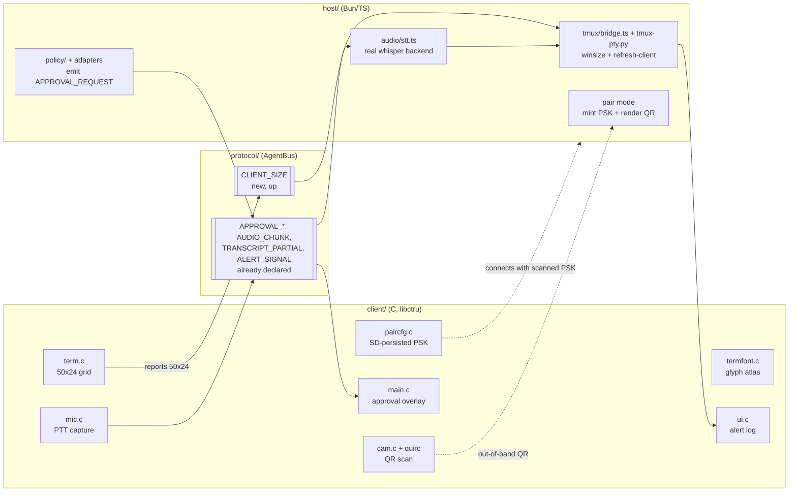
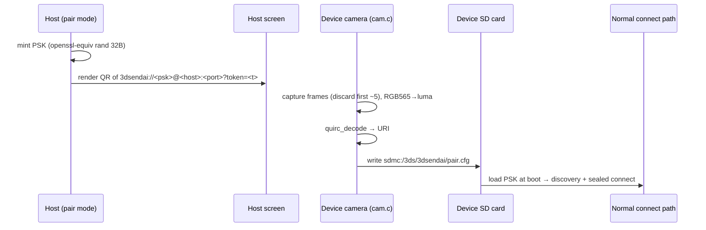
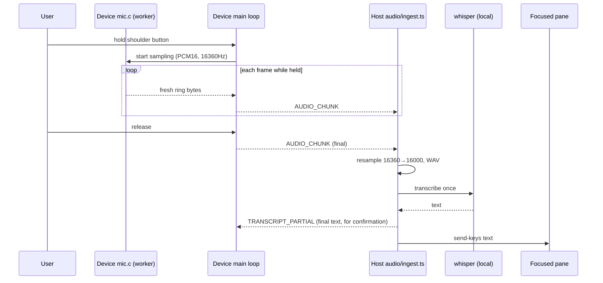

# feat: 3DSendai terminal fidelity, onboarding, and rich I/O

Six follow-on features for the on-hardware 3DSendai client, ordered correctness-first. The app now runs on real hardware and renders like a terminal; this plan closes the remaining fidelity gaps (pane sizing, glyph rendering), removes the onboarding wall (`config.h`-edit + rebuild), and lights up the reach features the protocol was already designed for (approval, alerts, voice).

**Key context from research:** the wire protocol already carries `APPROVAL_REQUEST/RESPONSE`, `AUDIO_CHUNK`, `TRANSCRIPT_PARTIAL`, and `ALERT_SIGNAL` (declared in the original structured-mode design); the host already has the `audio/` ingest→STT seam (`stt.ts` is an interface with only a `FakeStt`), the `policy/` approval classifier, and the Codex/Claude adapters; and `alert.c` already degrades to LED-only when `dspfirm.cdc` is missing. So features 4–6 are largely *wiring existing seams to the device + building the C side*, not greenfield.

---

## Problem Frame

The first hardware run (S4) proved the stack works but surfaced four fidelity/robustness gaps and left three "vision" features stubbed at the protocol layer only:

1. **Pane-size mismatch.** `tmux-pty.py` never sets a winsize, so tmux renders at its default (~80 cols) while the device shows 50. Output wraps at 80, then re-wraps at 50 — the root cause of the remaining "line breaks are still a little off" after the LF fix. The 3DS must be the authoritative terminal size.
2. **Fragile glyph rendering.** `termfont.c` draws each lit font pixel as a `C2D_DrawRectSolid` — one citro2d "object" per pixel. This overflowed the object budget (garbage triangles) and forced a defensive `C2D_Init(16384)`. It is slow, caps effective font scale, and the ASCII-only path forces `Yes/No` labels instead of glyphs like `⏎`.
3. **Onboarding wall.** Pairing requires editing `client/source/config.h` (`PAIR_PSK`) and running a devkitARM Docker build. No one but the author can change a PSK without rebuilding the app.
4. **Alerts are fire-and-forget.** The LED/tone fires but there is no on-screen record of *which* session alerted, and no way to mute a noisy one.
5. **No approval surface.** The coding-agent-companion premise — see a risky tool call, hit A/B with the lid shut — is unbuilt on the device even though the wire types and host policy exist.
6. **No voice input.** `AUDIO_CHUNK`/`TRANSCRIPT_PARTIAL` exist and the host audio seam exists, but there is no device mic capture and no real STT backend.

---

## Requirements

| ID | Requirement | Feature |
|----|-------------|---------|
| R1 | The device reports its terminal dimensions to the host; the host sizes the tmux client to match so wrapping happens once, at the device's width. | Pane-size sync |
| R2 | Glyphs render from a GPU texture atlas (one quad per cell), not per-pixel rects; per-cell foreground color is preserved; the object budget is no longer a fragility. | Glyph atlas |
| R3 | A user can pair a device by scanning a QR code the host displays — no `config.h` edit, no rebuild. The scanned secret persists on the SD card across launches. | Pairing |
| R4 | The device keeps an on-screen, scrollable log of recent alerts (which session, what class, rough time) and can mute alerts per session. | Alert log |
| R5 | When the host's structured mode raises an approval, the device shows it on the top screen and the user approves/denies with A/B, working with the lid closed. | Approval |
| R6 | Holding a shoulder button captures mic audio; on release the host transcribes it locally and injects the text into the focused session. Nothing leaves the local network. | Voice |
| R7 | Every new fallible service (camera, mic) and the DSP degrade gracefully on init failure rather than crashing; the terminal remains usable. | Cross-cutting |
| R8 | Generated files (`protocol/src/*.generated.ts`, `client/source/protocol.h`) are produced by `bun run codegen`, never hand-edited; sealed-byte changes regenerate golden vectors and the C KAT hex (AGENTS.md invariant #2). | Cross-cutting |

---

## High-Level Technical Design

### Feature-to-stack map



### Pairing flow (feature 3) — QR is out-of-band; no new wire frame



### Voice flow (feature 6) — record-on-release, not streaming



---

## Key Technical Decisions

- **KTD1 — Glyph atlas is a runtime `GPU_A8` texture built from the existing `font8x8` array (research Path B), not a baked `tex3ds`/romfs asset.** The Makefile has no romfs today; keeping the atlas runtime-built preserves the pure-C, no-new-build-tooling posture (AGENTS.md) and reuses the vendored font. Lay the atlas so each glyph occupies exactly one 8×8 GPU tile, so only the fixed 64-entry Morton swizzle is needed per glyph (avoids a general row-major→tiled transform). Per-cell fg via `C2D_DrawImageAt` + `C2D_TintSolid`. Draw backgrounds as a few large rects and skip blank cells so a full 50×24 screen is ~well under the 4096 object budget. *(see research: citro2d/citro3d texture handling)*
- **KTD2 — Pairing carries the secret out-of-band via the QR/camera; it adds no new wire frame.** The QR encodes a compact `3dsendai://<psk>@<host>:<port>?token=<t>` URI. The device decodes, persists to SD, and then uses the *existing* encrypted discovery + connect path unchanged. This keeps the protocol surface minimal and means pairing reuses all existing transport security.
- **KTD3 — `quirc` is vendored as a single `.c/.h` pair**, mirroring the existing Monocypher vendoring pattern (`client/source/monocypher.*` + a `VENDOR.md`). No new package/build dependency.
- **KTD4 — Voice is record-then-transcribe on button release, not streaming.** For short push-to-talk utterances the streaming re-decode cost buys nothing (the user is holding a button). The device streams `AUDIO_CHUNK`s while held; the host buffers, resamples 16360→16000 (existing `audio/resample.ts`), and transcribes once on release. *(see research: whisper.cpp latency)*
- **KTD5 — The real STT backend implements the existing `Stt` interface in `host/src/audio/stt.ts`.** `FakeStt` stays for tests. Default backend spawns local `whisper-cli` (or posts to a long-lived `whisper-server`) with an English `.en` model — nothing leaves the network. The backend is selected by env, defaulting to off so CI/tests never require a model.
- **KTD6 — `CLIENT_SIZE` is a new up-frame (value 73), applied host-side via `tmux-pty.py` initial winsize + a `refresh-client` on change.** 73 is the next free up-value after `KEYSTROKE=72`. The pty helper sets `TIOCSWINSZ` before `execvp`; the bridge issues a `refresh-client` sized to the device on each `CLIENT_SIZE`.
- **KTD7 — Approval reactivates only the emit/route path of structured mode, not the full HUD.** The device gets an approval overlay + A/B; the host wires `policy/` + adapter approval callbacks to emit `APPROVAL_REQUEST` and consume `APPROVAL_RESPONSE`. The broader structured-mode HUD stays retained/off-path.
- **KTD8 — Camera and mic run on worker threads with `linearAlloc`/aligned buffers**, never blocking the render loop on `svcWaitSynchronization` or mic polling. Each service gates behind its init `Result`; failure degrades (manual-entry fallback for camera, silent no-op for mic) per R7.

---

## Output Structure

New files (existing files modified in place are listed per-unit, not here):

```
client/source/
  cam.c / cam.h           # CAMU capture + quirc scan loop (worker thread)
  quirc.c / quirc.h       # vendored QR decoder (single pair)
  QUIRC-VENDOR.md         # provenance, mirrors MONOCYPHER-VENDOR.md
  mic.c / mic.h           # MICU push-to-talk ring capture
  paircfg.c / paircfg.h   # SD-persisted pairing config (parse/serialize)
client/test/
  paircfg_test.c          # host-KAT: URI parse + config round-trip
  quirc_kat_test.c        # host-KAT: decode a known-good QR byte buffer
  atlas_test.c            # host-KAT: glyph→tile Morton index math
host/src/audio/
  whisper-stt.ts          # real Stt backend behind the existing seam
host/src/tmux/
  (bridge.ts, tmux-pty.py modified)
```

---

## Scope Boundaries

**In scope:** all six features end-to-end across protocol/host/device, with pure-C logic covered by host KATs and host logic covered by `bun test`. Device-on-hardware behavior is verified by the user on the physical 3DS (the C client is runtime-unverified from a clean build alone — AGENTS.md).

### Deferred to Follow-Up Work
- **On-device PSK *display* pairing** (device mints + shows a QR/hex for the host to read) as an alternative to camera-scan. Camera-scan is the chosen default; the reverse direction is a later convenience.
- **Streaming STT** with mid-utterance partials. Record-on-release ships first (KTD4).
- **Full structured-mode HUD** (normalized multi-agent output, per-call diff view). Only the approval emit/route path reactivates here (KTD7).
- **Selectable font size / larger cells.** The atlas (U4) makes this cheap later, but this plan holds the grid at 50×24.

### Outside this product's identity
- On-device (3DS-side) speech recognition. STT stays host-side by design; the handheld is a thin remote.

---

## Implementation Units

### Phase 1 — Terminal fidelity (correctness first)

### U1. Protocol: add `CLIENT_SIZE` up-frame
- **Goal:** Device→host frame carrying terminal `{cols, rows}`.
- **Requirements:** R1, R8
- **Dependencies:** none
- **Files:** `protocol/codegen/message-types.source.ts` (add `CLIENT_SIZE = 73`, dir up), regenerate `protocol/src/*.generated.ts` + `client/source/protocol.h` via `bun run codegen`; `protocol/test/frames.test.ts`, `protocol/test/golden/vectors.json`, `protocol/test/golden/secure-vectors.json`, `client/test/frame_test.c`.
- **Approach:** Add the message type only (payload is canonical JSON `{cols, rows}`, no new constants). Run codegen — never hand-edit generated files. Because a new framed/sealed message type changes the golden set, regenerate `vectors.json` + `secure-vectors.json` and update the hardcoded hex in `client/test/frame_test.c` (AGENTS.md invariant #2).
- **Patterns to follow:** the existing `KEYSTROKE`/`FOCUS_SESSION` up-frames and their vector entries.
- **Test scenarios:**
  - Encode/decode round-trip of `CLIENT_SIZE {cols:50, rows:24}` yields identical struct (`frames.test.ts`).
  - Golden: sealed + plaintext framing of a fixed `CLIENT_SIZE` matches regenerated vectors (`golden.test.ts`, `secure-golden.test.ts`).
  - C KAT: `frame_test.c` frames the same payload to the same bytes as the TS golden.
  - Edge: out-of-range/zero dims decode without panic (host clamps later, U2).

### U2. Host: size the tmux client to the device
- **Goal:** Apply the device's `CLIENT_SIZE` to the live tmux client so wrapping happens once, at device width.
- **Requirements:** R1
- **Dependencies:** U1
- **Files:** `host/src/tmux/tmux-pty.py` (set `TIOCSWINSZ` before `execvp`; accept initial `cols,rows` via argv/env), `host/src/tmux/bridge.ts` (handle `CLIENT_SIZE` → issue `refresh-client` sized to device), `host/test/tmux-bridge.test.ts`.
- **Approach:** The pty helper packs `struct winsize{rows,cols,0,0}` and ioctls the slave before exec so tmux starts at the right size. On each `CLIENT_SIZE`, the bridge writes a `refresh-client` control command sized to the device via the existing `child.write()` seam. Default to 50×24 if no size received yet.
- **Patterns to follow:** existing `send-keys -H` command emission in `bridge.ts`.
- **Test scenarios:**
  - Given a `CLIENT_SIZE {50,24}`, the bridge writes a `refresh-client` command carrying 50×24 (assert on the injected `TmuxRunner` seam).
  - A second `CLIENT_SIZE` with new dims issues a new `refresh-client`; identical dims are a no-op (no redundant command).
  - Covers R1: with the pty sized to 50 cols, a captured pane line ≥50 chars wraps exactly once (control-mode test).
  - Edge: zero/absurd dims are clamped to a sane floor before emission.

### U3. Device: report size on attach
- **Goal:** Send `CLIENT_SIZE` after the connection is established (and on reconnect).
- **Requirements:** R1
- **Dependencies:** U1
- **Files:** `client/source/main.c` (send `CLIENT_SIZE {AB_TERM_COLS, AB_TERM_ROWS}` on HELLO/attach), `client/source/net.h`/`net.c` (send helper if none fits), `client/test/frame_test.c` (extend if a new C encode path is added).
- **Approach:** On the HELLO case in `on_frame` (where the picker already clears), also emit `CLIENT_SIZE` from the compile-time grid constants. Re-send on reconnect so a host restart re-sizes.
- **Patterns to follow:** `ab_net_send(AGENTBUS_MSG_FOCUS_SESSION, …)` in `main.c`.
- **Test scenarios:** `Test expectation: none — device-side wiring, runtime-unverified without hardware; the encode path is covered by U1's `frame_test.c`. Verified on hardware by the user (pane no longer double-wraps).`

### U4. Device: glyph texture-atlas renderer
- **Goal:** Replace per-pixel rects in `termfont.c` with one textured quad per cell.
- **Requirements:** R2, R7
- **Dependencies:** none (independent of U1–U3)
- **Files:** `client/source/termfont.c`, `client/source/termfont.h`, `client/source/ui.c` (`C2D_Init` budget can drop back toward default), `client/test/atlas_test.c`.
- **Approach (directional, not spec):** At init, allocate a `GPU_A8` `C3D_Tex` atlas sized to a power-of-two holding all 95 printable glyphs, each in its own 8×8 tile. Write each `font8x8` glyph into its tile using the fixed 64-entry Morton/Z-order swizzle, then `C3D_TexFlush`. Build a `C2D_Image` per glyph (subtex texcoords into the atlas). Render each non-blank cell with `C2D_DrawImageAt(img, x, y, depth, &tint, 1,1)` where `tint` is `C2D_PlainImageTint(fg, 1.0f)` under `C2D_TintSolid`. Draw row/screen backgrounds as large rects; skip spaces. Keep `AB_TERMFONT_SCALE` as the (now cheap) scale knob but hold it at 1 for this plan.
- **Patterns to follow:** existing `ab_termfont_draw` signature/contract (pure-drawing, no state mutation); Monocypher-style isolation of hardware-only code from host-KAT-able logic.
- **Execution note:** Extract the glyph→tile Morton index math into a pure-C helper so it host-compiles for `atlas_test.c`; keep the citro2d/`C3D_*` calls in the hardware-only path.
- **Test scenarios:**
  - Host-KAT (`atlas_test.c`): the tile-index for glyph N and the intra-tile Morton offset for pixel (x,y) match a hand-computed table for a spread of glyphs/pixels.
  - Host-KAT: every printable ASCII 0x20–0x7E maps to a distinct, in-bounds atlas tile.
  - `Test expectation (render): none — citro2d output is runtime-unverified; the user confirms on hardware that text renders crisply and no garbage triangles appear, and that Yes/No labels can revert to glyphs.`

### Phase 2 — Onboarding

### U5. Host: `pair` mode — mint PSK + render QR
- **Goal:** A host command that mints a PSK and prints a scannable QR encoding the pairing URI.
- **Requirements:** R3
- **Dependencies:** none
- **Files:** `host/src/index.ts` or a new `host/src/pair.ts` (mode entry), reuse `host/src/psk.ts` for minting; `host/test/` new `pair.test.ts`.
- **Approach:** Add a `pair` entry that mints a 32-byte PSK (existing `psk.ts`), composes `3dsendai://<psk>@<host>:<port>?token=<token>`, and renders it as a terminal QR (small vendored/qr lib or a dependency-free QR encoder — prefer an existing lightweight dep already permitted by the repo; otherwise render to a PNG file path). Print the PSK hex too as a manual fallback.
- **Patterns to follow:** existing env/config surface in `host/src/index.ts`; `psk.ts` minting.
- **Test scenarios:**
  - Minted PSK is 64 lowercase hex chars; URI parses back to the same PSK/host/port/token.
  - URI round-trips through the device parser's expected grammar (shared fixture with U7).
  - Edge: host address absent → URI omits host and relies on discovery (device still pairs via broadcast).

### U6. Device: camera capture + QR decode
- **Goal:** Vendor `quirc`, add a `cam.c` capture/scan module, and a scan screen.
- **Requirements:** R3, R7
- **Dependencies:** none (decoder is independent of U5's exact URI, shared fixture aligns them)
- **Files:** `client/source/quirc.c`/`quirc.h`, `client/source/QUIRC-VENDOR.md`, `client/source/cam.c`/`cam.h`, `client/source/main.c` (scan screen entry), `client/Makefile` (compile new sources), `client/test/quirc_kat_test.c`.
- **Approach (directional):** `camInit` → `SELECT_OUT1`/`PORT_CAM1`, `SIZE_QVGA` or `SIZE_CTR_TOP_LCD`, `OUTPUT_RGB_565`; `linearAlloc` double buffers; capture on a worker thread, `CAMU_SetReceiving` + `svcWaitSynchronization`. Discard the first ~5 frames (auto-exposure), convert RGB565→8-bit luma, feed `quirc_begin/_end/_extract/_decode`. On a successful decode hand the URI to U7. Gate all of it behind `R_SUCCEEDED(camInit())`; on failure show a "type PSK manually / rebuild" message (R7).
- **Patterns to follow:** Monocypher vendoring (`MONOCYPHER-VENDOR.md`); worker-thread + `linearAlloc` discipline; reference camera loop from devkitPro `camera/image` and FlagBrew/QRaken.
- **Execution note:** Keep the RGB565→luma conversion and the quirc-buffer plumbing as pure-C helpers so `quirc_kat_test.c` can decode a checked-in known-good luma buffer without hardware.
- **Test scenarios:**
  - Host-KAT (`quirc_kat_test.c`): decoding a checked-in luma buffer of a known QR yields the exact expected URI string.
  - Host-KAT: RGB565→luma conversion of a fixed pixel block matches expected 8-bit values.
  - `Test expectation (capture): none — CAMU is runtime-unverified; user confirms on hardware that scanning the host QR pairs the device.`

### U7. Device: persist + load scanned pairing
- **Goal:** Store the scanned pairing on SD and load it at boot, superseding `config.h` as the primary source.
- **Requirements:** R3
- **Dependencies:** U6 (supplies the URI); shares the URI fixture with U5
- **Files:** `client/source/paircfg.c`/`paircfg.h`, `client/source/main.c` (load at boot; fall back to `config.h` when no `pair.cfg`), `client/test/paircfg_test.c`.
- **Approach:** Parse the `3dsendai://` URI into `{psk, host, port, token}`. Serialize to `sdmc:/3ds/3dsendai/pair.cfg` (simple key=value or the URI verbatim). At boot, load `pair.cfg` if present; else use the compile-time `config.h` values. `config.h` remains as a dev/build-time fallback (not removed).
- **Patterns to follow:** existing `config.h` consumption in `main.c`/`net.c`; `json.c` parsing style for the tiny parser.
- **Execution note:** Parser/serializer are pure C — fully host-KAT'd.
- **Test scenarios:**
  - Host-KAT: parse a valid URI → correct fields; serialize→parse round-trips.
  - Host-KAT: malformed URI (missing psk, bad port, wrong scheme) is rejected without crashing; loader falls back to `config.h`.
  - Host-KAT: PSK that is not 64 hex chars is rejected.
  - Edge: absent `pair.cfg` → clean fallback to compile-time config.

### Phase 3 — Reach features

### U8. Device: on-screen alert log + per-session mute
- **Goal:** A scrollable record of recent alerts and a per-session mute toggle.
- **Requirements:** R4
- **Dependencies:** U4 (renders through the atlas, but not strictly blocking)
- **Files:** `client/source/alert.c`/`alert.h` (ring of recent alert records + mute set), `client/source/ui.c` (log view on the bottom screen), `client/source/main.c` (`ALERT_SIGNAL` case records + respects mute), `client/test/` extend or add an alert-log KAT.
- **Approach:** Add a fixed-size ring of `{session_id, class, frame_counter}` populated in the `ALERT_SIGNAL` handler. A per-session mute flag suppresses LED/tone but still logs. Render the ring as a list view reachable from the control strip. Time is approximate (frame counter or a coarse tick) — no RTC dependency.
- **Patterns to follow:** existing scrollback ring in `term.c`; `ab_alert_fire` gating.
- **Execution note:** The ring insert/evict + mute logic is pure C — host-KAT it.
- **Test scenarios:**
  - Host-KAT: N+1 alerts into an N-slot ring evict oldest; order preserved.
  - Host-KAT: a muted session's alert is recorded but `ab_alert_fire`'s effect is suppressed (assert via a seam/flag).
  - `Test expectation (view): none — rendering runtime-unverified; user confirms the log shows on hardware.`

### U9. Device: approval overlay + A/B response
- **Goal:** Show `APPROVAL_REQUEST` on the top screen; A approves, B denies; send `APPROVAL_RESPONSE`.
- **Requirements:** R5, R7
- **Dependencies:** U1-style codegen already covers the frames (they exist); pairs with U10
- **Files:** `client/source/main.c` (`APPROVAL_REQUEST` case → overlay state; A/B in `handle_buttons` → `APPROVAL_RESPONSE`), `client/source/ui.c` (overlay render), `client/test/` (approval-state KAT if logic warrants).
- **Approach:** Add an `on_frame` case that parses the approval (id, summary text) into an overlay struct. While an approval is pending, the top screen shows it; `A`/`B` send `APPROVAL_RESPONSE {id, allow}` and clear it. Works lid-closed because `aptSetSleepAllowed(false)` already keeps services alive. Multiple pending approvals queue (reuse a small ring).
- **Patterns to follow:** existing `on_frame` JSON parsing (`json_get_string`); `ab_net_send` for the response; `handle_buttons` button routing (A/B are currently Enter/Esc — approval mode overrides them while an overlay is active).
- **Test scenarios:**
  - Host-KAT (if extracted): approval queue holds/dequeues in order; responding clears the head.
  - Button mapping: while an overlay is active, A/B route to response (not Enter/Esc); with no overlay, they behave as before.
  - `Test expectation (render/hardware): none — user confirms A/B on hardware with the lid closed.`

### U10. Host: emit approvals + route responses
- **Goal:** Wire the existing `policy/` + adapter approval hooks to emit `APPROVAL_REQUEST` to the device and consume `APPROVAL_RESPONSE`.
- **Requirements:** R5
- **Dependencies:** U9 (device side)
- **Files:** `host/src/policy/index.ts`, `host/src/server/connection.ts` (route `APPROVAL_RESPONSE`), the Codex/Claude adapters under `host/src/adapters/` (surface the pending-approval callback), `host/test/policy.test.ts`, `host/test/connection.test.ts`.
- **Approach:** When an adapter reports a tool call the policy classifies as requiring approval, emit `APPROVAL_REQUEST {id, summary, session}` to the connected device and park the call until an `APPROVAL_RESPONSE {id, allow}` returns (or a timeout denies). This reactivates only the emit/route path (KTD7); the full HUD stays off-path.
- **Patterns to follow:** existing `policy/classify.ts` decisions; the adapter interface in `host/src/adapters/interface.ts`; existing up-message routing in `connection.ts`.
- **Test scenarios:**
  - A classified-risky tool call emits exactly one `APPROVAL_REQUEST` with a stable id.
  - An `APPROVAL_RESPONSE {allow:true}` resumes the parked call; `{allow:false}` cancels it.
  - Timeout with no response denies by default (assert the safe default).
  - Two concurrent approvals get distinct ids and resolve independently.

### U11. Device: mic push-to-talk capture
- **Goal:** Hold a shoulder button to capture mic PCM and stream `AUDIO_CHUNK`; release ends the utterance.
- **Requirements:** R6, R7
- **Dependencies:** none (host side is U12)
- **Files:** `client/source/mic.c`/`mic.h`, `client/source/main.c` (`handle_buttons`: shoulder-hold gates capture; send `AUDIO_CHUNK`), `client/test/` (ring-read offset KAT).
- **Approach (directional):** `micInit` with a 0x1000-aligned buffer; `MICU_StartSampling(MICU_ENCODING_PCM16_SIGNED, MICU_SAMPLE_RATE_16360, …, loop=true)`. While the chosen shoulder button is held, each frame read fresh bytes between the last offset and `micGetLastSampleOffset()` (handle wraparound) and send them as `AUDIO_CHUNK`. On release, send a final chunk / end marker. Gate behind `R_SUCCEEDED(micInit())`; on failure the feature silently no-ops (R7). Note the real rate is 16360 Hz, not 16000 — the host resamples (U12).
- **Patterns to follow:** worker/polling discipline; `ab_net_send` for `AUDIO_CHUNK`; existing button handling in `handle_buttons`.
- **Execution note:** Extract the ring-offset delta + wraparound math into a pure-C helper for a host-KAT; keep MICU calls in the hardware path.
- **Test scenarios:**
  - Host-KAT: ring-delta computation across a wraparound returns the correct contiguous byte spans.
  - Button gating: chunks are only produced while the shoulder button is held; release stops capture.
  - `Test expectation (mic hardware): none — MICU runtime-unverified; user confirms capture on hardware (New 2DS XL mic).`

### U12. Host: real whisper STT backend + inject transcript
- **Goal:** Implement a real `Stt` backend and wire `AUDIO_CHUNK` → transcribe on release → inject into the focused pane.
- **Requirements:** R6
- **Dependencies:** U11 (audio source); reuses existing `audio/ingest.ts`, `audio/resample.ts`
- **Files:** `host/src/audio/whisper-stt.ts` (new backend implementing `Stt`), `host/src/audio/ingest.ts` (buffer-until-release; on finalize, resample + transcribe), `host/src/server/connection.ts` (`AUDIO_CHUNK` route; inject final text via the tmux bridge send-keys path), `host/test/audio.test.ts`.
- **Approach:** `whisper-stt.ts` buffers PCM, and on `finalize()` resamples 16360→16000 (existing `resample.ts`), wraps a WAV, and transcribes once via local `whisper-cli` (`Bun.spawn`) or a long-lived `whisper-server` (`fetch`), returning text. Selected by env (e.g. `SENDAI_STT=whisper`), defaulting off so tests/CI use `FakeStt` and need no model. On the final `AUDIO_CHUNK`, inject the transcript into the focused session through the same `send-keys` path keystrokes use; optionally echo `TRANSCRIPT_PARTIAL` back for on-device confirmation.
- **Patterns to follow:** the existing `Stt` interface + `FakeStt` in `stt.ts`; `audio/ingest.ts` seam; the bridge `send-keys` injection in `bridge.ts`.
- **Test scenarios:**
  - With `FakeStt`, a buffered utterance finalizes to the scripted transcript and injects it via the bridge seam (assert on the injected `send-keys`).
  - `resample.ts` maps a 16360 Hz buffer to 16000 Hz with expected length; a silent buffer yields empty text (no spurious injection).
  - Backend selection: default env → `FakeStt` (no model needed); `SENDAI_STT=whisper` selects the real backend (constructed, not invoked, in the unit test).
  - Integration: `AUDIO_CHUNK` frames route to ingest and the final chunk triggers exactly one transcription.

---

## Risk Analysis & Mitigation

| Risk | Likelihood | Impact | Mitigation |
|------|-----------|--------|------------|
| Camera QR scanning unreliable on hardware (focus/exposure) | Medium | Medium | Discard warmup frames; keep the PSK-hex manual fallback (U5 prints it, `config.h` still works); QRaken reference loop. |
| Built-in mic too noisy for usable STT | Medium | Medium | Moderate gain + host-side resample; `.en` model; record-on-release keeps utterances short. If unusable, voice degrades to no-op (R7) and the feature is deferred without blocking others. |
| Atlas tiling (Morton swizzle) rendered wrong | Medium | High (garbage glyphs) | Pure-C index math is host-KAT'd (U4) before any hardware run; one-glyph-per-tile keeps the swizzle to a fixed 64-entry table. |
| Golden-vector / C-KAT drift from the new frame | Medium | High (CI gate) | U1 regenerates vectors + C hex via codegen and updates `frame_test.c` in the same unit; CI drift gate enforces it. |
| Structured-mode reactivation pulls in more than the approval path | Low | Medium | KTD7 scopes to emit/route only; adapters already exist, no HUD work. |
| whisper adds a heavy host dependency | Low | Low | Backend is env-gated and defaults off; CI/tests never require a model. |

## Dependencies / Prerequisites

- devkitARM Docker build for every `client/` change; `bun test` + `bun run typecheck` + `client/test/run.sh` for host/protocol/C-KAT (AGENTS.md).
- `whisper.cpp` built locally on the host for real voice (not needed for CI).
- User's physical 3DS for all device-on-hardware verification.

## Sequencing

Phase 1 (U1→U2, U3; U4 independent) lands first — it finishes making the terminal *correct*. Phase 2 (U5; U6→U7) removes the onboarding wall. Phase 3 (U8; U9↔U10; U11→U12) adds the reach features. Within Phase 3, approval (U9/U10) and voice (U11/U12) are independent tracks and can proceed in either order.

---

## Alternatives Considered

- **Atlas via baked `tex3ds`/romfs (research Path A) vs. runtime `GPU_A8` atlas (Path B).** Path A is less code but adds a romfs asset + `tex3ds` build step + a font PNG the Makefile doesn't have today. Path B reuses the vendored `font8x8` array and keeps the build pure-C. Chose B (KTD1); Path A remains a clean future swap if a richer font is wanted.
- **Pairing by device-displayed code vs. camera scan.** Device-displayed (device mints, host reads) avoids camera code but needs the host to have a camera/reader and inverts the "thin handheld" ergonomics. Camera scan matches the hardware (3DS has cameras) and the host already has a screen. Chose scan (KTD2); display deferred.
- **Streaming STT vs. record-on-release.** Streaming gives mid-utterance partials at real CPU/complexity cost that buys nothing for button-held utterances. Chose record-on-release (KTD4).
- **New pairing wire frame vs. out-of-band QR.** A wire-level pairing handshake would duplicate transport security work; the QR carries the secret out-of-band and reuses the existing encrypted path. Chose out-of-band (KTD2) — zero new protocol surface for pairing.

---

## Sources & Research

- **citro2d/citro3d text + texture:** atlas via `C2D_SpriteSheet`/`tex3ds` (Path A) or runtime `C3D_Tex` `GPU_A8` with per-8×8-tile Morton swizzle (Path B); per-cell color via `C2D_DrawImageAt` + `C2D_TintSolid`; object budget = one quad per object, draw bg as large rects and skip blanks to stay under 4096. (devkitPro citro2d/citro3d headers + examples.)
- **CAMU camera:** `SELECT_OUT1`/`PORT_CAM1`, `OUTPUT_RGB_565`, `linearAlloc` double buffers, `CAMU_SetReceiving` + `svcWaitSynchronization`; discard ~5 warmup frames. Decoder: vendored **quirc**; reference loop **FlagBrew/QRaken**. (libctru `cam.h`, devkitPro `camera/image` example.)
- **ndsp/dspfirm:** gate on `R_SUCCEEDED(ndspInit())` (already implemented in `alert.c`); no practical non-DSP audio path — visual/LED is the guaranteed channel.
- **MICU mic:** `PCM16_SIGNED`, real rate `MICU_SAMPLE_RATE_16360` (≈16364 Hz, *not* 16000), 0x1000-aligned buffer, ring via `micGetLastSampleOffset`. (libctru `mic.h`.)
- **whisper.cpp host STT:** record-on-release; `whisper-cli` spawn or `whisper-server` HTTP; expects 16kHz mono PCM (resample 16360→16000); `.en` tiny/base ≈ sub-second–2s per short clip on CPU. (ggml-org/whisper.cpp.)

*(Full research digest captured during planning; device-on-hardware behavior remains user-verified per AGENTS.md.)*
