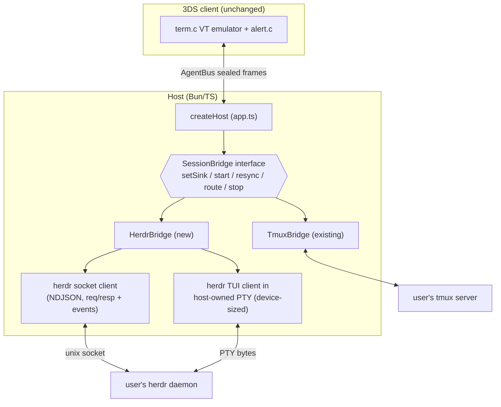
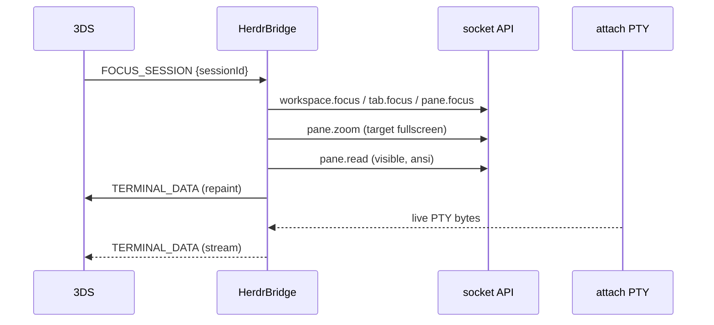

# feat: herdr session backend alongside tmux

## Summary

Add herdr (herdr.dev) as an alternative session backend on the host so users who run herdr instead of tmux can pick up and drive their agent panes from the 3DS. A new `HerdrBridge` slots in behind a `SessionBridge` interface extracted from the existing tmux bridge; the wire protocol and the 3DS client do not change.

## Problem Frame

3DSendai's terminal mode is tmux-shaped: the host attaches to the user's tmux server as a control-mode client and bridges sessions to the device (see docs/brainstorms/2026-07-01-3ds-tmux-terminal-macropad-requirements.md). herdr is an agent multiplexer — daemon-persisted PTYs, workspaces/tabs/panes, semantic agent states (idle/working/blocked/done) — that occupies tmux's seat for a growing set of agent-heavy users. For them, 3DSendai currently has nothing to attach to.

The existing frame vocabulary (`SESSION_STATE`, `SESSION_LIST`, `TERMINAL_DATA`, `KEYSTROKE`, `CLIENT_SIZE`, `ALERT_SIGNAL`) is already backend-neutral, and `createHost` only touches the bridge through five methods — so a second backend is a host-side addition, not a protocol or device change. herdr's semantic agent states are a fidelity upgrade over tmux's bell/idle heuristics for the alert system.

---

## Requirements

**Backend parity**

- R1. With the herdr backend selected, the host attaches to the user's running herdr daemon as a socket client and enumerates panes as device-selectable sessions, without spawning or managing herdr itself.
- R2. The focused pane bridges bidirectionally: live terminal output streams to the device as `TERMINAL_DATA`; device `KEYSTROKE` frames deliver into the pane; the bridge survives the user's own herdr clients attaching and detaching.
- R3. `FOCUS_SESSION` switches the focused pane (including panes in other workspaces/tabs), repainting the device from herdr's own buffer, with a clear repaint boundary so output from the previously focused pane is never rendered into the new one. Device reconnects resync the same way. The host keeps no terminal ring buffer.
- R4. `CLIENT_SIZE` governs the terminal grid the device renders, with the same clamping behavior as the tmux backend.
- R5. herdr agent states drive `ALERT_SIGNAL` with the existing taxonomy: `blocked` → `attention`, `done` → `likely_done`, pane exit → `session_ended`. `working`/`idle`/`unknown` raise no alert, and no new alert class is added (herdr's definitive `done` reuses `likely_done` — a distinct class means codegen, golden vectors, and C KAT churn; revisit only with evidence).
- R6. Macropad quick-actions fire into the focused pane through the same `KEYSTROKE` path, unchanged.
- R11. On device attach or reconnect, the host re-derives pending alerts from current agent states (any pane still `blocked` → `attention`, `done` → `likely_done`), deduped once per state transition — alerts that fired into a sleeping device are not lost. This exceeds tmux parity deliberately: herdr's states are stateful where tmux bells are ephemeral.

**Compatibility**

- R7. Zero changes to the wire protocol and the C client: existing frame types only, no codegen or golden-vector churn.
- R8. tmux remains the default backend. The backend is chosen at host launch; one backend per host process. Existing `SENDAI_TMUX=1` launches keep working.
- R9. herdr missing, daemon unreachable, or protocol-version mismatch surfaces as a clear `ERROR` frame and host log — never a silent hang. The host verifies the daemon's protocol via `ping` at startup and tolerates unknown fields.

**Verification**

- R10. The herdr bridge is covered by hermetic tests against a fake herdr socket built from captured real-daemon fixtures; an e2e test drives it through the real encrypted server; an optional integration test runs against a real herdr daemon and skips when herdr is absent.

---

## Key Technical Decisions

- **Sibling backend behind an extracted `SessionBridge` interface.** `createHost` already touches the bridge only through `setSink/start/resync/route/stop`; extracting that surface as an interface lets `TmuxBridge` and `HerdrBridge` coexist with a one-line widening of `HostOptions.bridge`. Keeps the device and protocol untouched (R7) and stays out of golden-vector regeneration entirely.
- **External socket client, not a herdr plugin.** herdr plugin v1 is invocation-based (actions/hooks/panes) with no persistent-daemon lifecycle contract; the host already runs its own process. The bridge speaks herdr's newline-delimited-JSON socket directly with `Bun.connect` and hand-rolled framing — no client library, matching house style. A marketplace plugin wrapper is deferred.
- **Terminal stream: host-owned herdr TUI client in a PTY, focused pane zoomed.** herdr's socket API has no raw pane-output stream (verified against the full API schema — all 80 methods, all 24 subscriptions; `pane.read` is snapshot-only). The primary design runs `herdr session attach` inside a host-owned PTY sized to the device, uses the socket to focus + zoom the target pane, and streams the PTY bytes as `TERMINAL_DATA` — "be a real client" applied to herdr, mirroring the `tmux-pty.py` precedent. **Fallback if the U1 spike falsifies this** (TUI chrome pollution, keybinding interception, shared focus with the desk client): revision-polled `pane.read` (`format: "ansi"`, `strip_ansi: false`) snapshot repaints.
- **Keystrokes via socket `pane.send_input`, targeted at the pane — the PTY is output-only.** Raw writes into the attach PTY would hit the herdr TUI's own keybindings first (Esc/Ctrl chords could trigger TUI actions instead of reaching the agent) and can race a focus switch into the wrong pane. Socket input keeps the device's `sessionId` targeting honest in both the primary and fallback designs, shrinking their difference to "where output bytes come from." Cost: `KEYSTROKE` hex needs a small byte→key-name/text mapping (the control set is finite, anchored on `host/src/tmux/keymap.ts` vocabulary); U1 verifies `send_input` semantics. Raw-PTY input is the alternative only if the spike shows socket input is lossy for something the terminal needs.
- **Device session = herdr pane.** The unit the user picks up is a pane (agent or plain shell — whatever runs in it is opaque, as with tmux). Agent metadata (`agent`, `agent_status`, title) enriches the label and status; workspaces/tabs surface only as label context.
- **Alerts from herdr's semantic states, not output heuristics.** `pane.agent_status_changed` + `pane.exited`/`pane.closed` subscriptions replace BEL-scanning and the 30s activity-then-idle timer where herdr reports states; the mapping lives in R5.
- **Config generalizes the existing mode switch.** `SENDAI_BACKEND=tmux|herdr` in `host/bin/host.ts`, with `SENDAI_TMUX=1` preserved as an alias for `SENDAI_BACKEND=tmux`. herdr socket resolution follows herdr's own order (`SENDAI_HERDR_SESSION` → named-session socket path, else default `~/.config/herdr/herdr.sock`), mirroring `SENDAI_TMUX_SOCKET`/`SENDAI_TMUX_SESSION`.

## Assumptions

Un-validated bets made without a synchronous user to confirm; redirect any of these before or during implementation.

- Parity scope is the full terminal-mode feature set (terminal + macropad + alerts + multi-session + reconnect), not a reduced herdr mode.
- The host runs on the same machine as the herdr daemon (the socket has no auth beyond filesystem permissions) — the same posture as the tmux backend today; a VPS herdr means running the host on that VPS.
- Pane-level session mapping (not workspace-level) is what a herdr user expects to "pick up" from the couch.
- PTY-attach is viable only if zoom leaves zero chrome: the `pane.read` repaint and the live TUI stream must share one coordinate space, so any surviving status bar offsets every repaint against the bytes that follow it. If chrome survives zoom, the repaint mechanism must become a TUI-level redraw or the design falls back to polling — U1's decision rule owns this call.

---

## High-Level Technical Design

Component topology and the two herdr channels (structure/state via socket, terminal bytes via PTY):

Focus switch under the primary (PTY-attach) design:

Concept mapping (directional guidance, not implementation specification):

| herdr concept | 3DSendai concept |
|---|---|
| session (named daemon instance) | the backend target the host attaches to |
| workspace / tab | label context on the session list |
| pane | device "session" (`SESSION_STATE` entry) |
| agent status `blocked` | `ALERT_SIGNAL` class `attention` |
| agent status `done` | `ALERT_SIGNAL` class `likely_done` |
| `pane.exited` / `pane.closed` | `ALERT_SIGNAL` class `session_ended` |
| `session.snapshot` + event subscriptions | bridge bootstrap + incremental session-list updates |
| `pane.read` revision counter | change detection (polling fallback only) |

---

## Implementation Units

### U1. Spike: validate PTY-attach against a real herdr daemon; capture fixtures

- **Goal:** Settle the primary-vs-fallback fork in the terminal-stream decision with evidence, and capture the socket fixtures every later unit tests against.
- **Requirements:** R2, R3, R10 (grounding)
- **Dependencies:** none
- **Files:** `host/test/fixtures/herdr/` (new captured NDJSON + PTY transcripts, plus a README recording the herdr version and protocol number)
- **Approach:** Install herdr at a pinned version; run a scratch named session (never the user's default socket). Validate, in order: (1) `herdr session attach` runs inside a host-owned PTY and renders a zoomed pane — specifically whether zoom leaves **zero** chrome at 50x24 (the repaint design requires the `pane.read` repaint and the live TUI stream to share one coordinate space; any surviving status bar offsets them) and whether the render stays within what `term.c` handles; (2) `pane.send_input` semantics — single keys (Enter, Ctrl-C, Esc, arrows, Tab) **and mixed text+control payloads**: keystroke hex for `y` + CR must arrive as ordered text `y` then Enter, and a `literal:` payload with an embedded newline must preserve byte order across the resulting calls; (3) **contention**: with a second (desk-sized) client attached, is focus/zoom per-client or daemon-global, and how is the grid size resolved between two clients of different dimensions — this can falsify PTY-attach *and* degrades the `pane.read` fallback (snapshots render at the daemon-held size); (4) how a repaint is triggered for a freshly attached or resized client, including a device resync with **no** focus change, where the TUI performs no natural redraw; (5) `CLIENT_SIZE`-driven PTY winsize changes actually reflow the TUI — this step needs a throwaway resize-capable PTY wrapper (or U4's `herdr-pty.py` built early), since `tmux-pty.py` only sets winsize once at exec; (6) record keystroke echo latency and sustained-output throughput numbers so the outcome is decided on data (guidance: echo under ~150ms). Capture NDJSON traffic for: `ping`, `session.snapshot`, pane list/focus/zoom, `pane.send_input`, `events.subscribe` pushes for `pane.agent_status_changed`/`pane.exited`, and error responses (daemon absent, unknown pane). Before committing, scrub the captured NDJSON and PTY transcripts — replace real paths, usernames, env-derived values, and token-shaped strings with synthetic placeholders, and note the scrub in the fixtures README; these are agent-session transcripts entering permanent git history.
- **Decision rule (deliverable):** a recorded three-way call, not a binary go/no-go — (a) per-client focus and workable sizing → PTY-attach primary; (b) global focus but acceptable snapshot sizing → polling fallback; (c) global focus **and** daemon-held-size snapshots → halt after U2, file the upstream herdr request (per-client focus/zoom or a raw pane-output subscription), and do not start U3–U6 until it resolves.
- **Execution note:** Fixture-first discipline per docs/solutions/architecture-patterns/driving-coding-agent-clis-from-a-host.md — build later parsers from these captures, never from memory of the docs.
- **Test scenarios:** Test expectation: none — exploratory spike; its deliverables are the captured (scrubbed) fixtures, the version pin, and the recorded three-way decision.
- **Verification:** Fixtures exist, are scrubbed, and are referenced by U3/U4 tests; the three-way decision is written down with the observed evidence.

### U2. Extract the `SessionBridge` interface

- **Goal:** Name the existing five-method bridge seam as an interface both backends implement, with no behavior change.
- **Requirements:** R7, R8
- **Dependencies:** none
- **Files:** `host/src/app.ts`, `host/src/tmux/bridge.ts`, `host/src/index.ts`, `host/test/tmux-bridge.test.ts`
- **Approach:** Define `SessionBridge` (`setSink`, `start`, `resync`, `route`, `stop`) where `app.ts` currently type-imports `TmuxBridge` concretely; `TmuxBridge` implements it; `HostOptions.bridge` widens to the interface. Export the interface from `host/src/index.ts`. Pure refactor — no frame or behavior changes.
- **Patterns to follow:** The seam is already exercised by `host/test/e2e-tmux.test.ts`; keep the header-comment plan-unit citation convention used in `bridge.ts`.
- **Test scenarios:** Existing tmux bridge and e2e suites pass unchanged. A minimal fake implementing `SessionBridge` type-checks as `HostOptions.bridge` (compile-level assertion in the test file).
- **Verification:** `bun test` and `bun run typecheck` green with no test edits beyond the compile-level assertion.

### U3. herdr socket client

- **Goal:** A small, fixture-tested client for herdr's NDJSON socket protocol: requests, correlated responses, pushed events, bootstrap.
- **Requirements:** R1, R5, R9
- **Dependencies:** U1
- **Files:** `host/src/herdr/socket.ts` (new), `host/test/herdr-socket.test.ts` (new), fixtures from U1
- **Approach:** `Bun.connect` to the resolved socket path; newline-delimited JSON framing with partial-line buffering; request/response correlation by `id`; pushed subscription events discriminated by the absence of `id`; typed error responses. On connect: `ping`, check `protocol` against the pinned-supported number, then `session.snapshot` + `events.subscribe`. Warn-and-continue on a newer protocol is gated by a capability check — validate that the snapshot and subscription acknowledgment carry the exact fields and event names the bridge reads (pane ids, `agent_status`, `pane.agent_status_changed`, `pane.exited`); a newer daemon missing any of them escalates to the R9 `ERROR` path instead of a log warning, because "tolerate unknown fields" covers additive changes, not renames of fields the alert pipeline depends on. Connection loss surfaces as an error event to the owner, never a hang.
- **Patterns to follow:** Pure parser + injected transport, mirroring `host/src/tmux/control-mode.ts`; explicit `Uint8Array` field annotations per docs/solutions/developer-experience/bun-and-workflow-tooling-gotchas.md.
- **Test scenarios:** Response correlation with out-of-order ids; a pushed event interleaved mid-request resolves both correctly; a JSON line split across two socket chunks parses once complete; error response (`{id, error}`) rejects the pending request with code and message; unknown fields in results are ignored; `ping` protocol mismatch produces the documented warn/error behavior; a newer-protocol snapshot missing a required field (e.g. `agent_status`) escalates to the error path rather than warning; socket close with a pending request rejects it and emits the client-level error event.
- **Verification:** All scenarios green against U1 fixtures; no live herdr needed.

### U4. `HerdrBridge`

- **Goal:** The `SessionBridge` implementation that bridges herdr panes to the device.
- **Requirements:** R1, R2, R3, R4, R5, R6, R11
- **Dependencies:** U2, U3; plan-004's CLIENT_SIZE work (the frame plus `clampSize`/bridge routing) merged to main
- **Files:** `host/src/herdr/bridge.ts` (new), `host/src/herdr/runner.ts` (new — process/PTY seam, injectable for tests), `host/src/herdr/herdr-pty.py` (new — generalizes `tmux-pty.py` with a runtime resize channel), `host/test/herdr-bridge.test.ts` (new)
- **Approach:** Bookkeeping maps device-facing session ids to herdr pane ids; device ids are never reused within a host process, and frames referencing unknown/stale ids are dropped (matching `route()`'s existing discipline) — a daemon restart re-enumerates under fresh ids. Labels default to `herdr:<tab>/<pane-title>`, truncated **and stripped of control/escape bytes** for the device — pane titles are process-controlled (set via terminal title escape sequences by whatever runs in the pane), not operator-chosen like tmux session names; all panes are listed, agent metadata enriching status. `start()`: snapshot + subscribe; emit one `SESSION_STATE` per pane then the `SESSION_LIST` boundary (the device JSON scanner cannot parse arrays — keep per-object emission); zero panes is an empty board that populates from `pane.created` events, not an error. Focus: socket `workspace.focus`/`tab.focus`/`pane.focus` + `pane.zoom`, with a repaint boundary — in-flight PTY bytes are dropped from the moment focus changes until the `pane.read` (visible, ansi) repaint is emitted, so old-pane output never smears into the new session's grid. Reconnect resync (`resync()`) repaints from `pane.read` the same way in both primary and fallback modes — herdr owns the buffer, host keeps no ring — and re-derives pending alerts from current agent states (R11). `start()` keeps the synchronous `SessionBridge` contract: the socket bootstrap runs async internally, `resync()`/`route()` calls arriving pre-bootstrap are queued and flushed once the snapshot applies, and a bootstrap failure emits the R9 `ERROR` through the sink asynchronously (the tmux bridge could enumerate synchronously; herdr cannot). Terminal bytes chunk through the existing `splitTerminalHex`. Keystrokes: validated hex → a byte-stream segmenter (ordered runs of text plus key names, anchored on the `keymap.ts` vocabulary — macropad payloads like approve's `y` + CR are mixed text+control in one frame) → ordered `pane.send_input` calls targeted at the focused pane id. `CLIENT_SIZE`: clamp via the existing `clampSize`, dedupe, then resize the PTY at runtime — `herdr-pty.py` accepts resize commands on a dedicated inherited fd, applies `TIOCSWINSZ` on the master, and signals `SIGWINCH` (`tmux-pty.py` sets winsize once at exec and has no resize channel, so `runner.ts` exposes `resize(cols, rows)` on the child seam). Alerts: `pane.agent_status_changed` (`blocked` → `attention`, `done` → `likely_done`; `working`/`idle`/`unknown` silent, deduped once per transition), `pane.exited`/`pane.closed` → `session_ended` (idempotent); pane created/closed events refresh the board. Focused pane closing: stop attributing PTY output, emit `session_ended` + fresh board, and wait for the device to pick — never auto-zoom a pane the user didn't choose. Daemon connection loss or restart (socket EOF, PTY child death): end all sessions, emit `ERROR`, clear child state so the next device ATTACH retries `start()` cleanly — do not copy the tmux bridge's stale-child behavior. If U1 chose the polling fallback, the PTY seam is replaced by a revision-gated `pane.read` loop behind the same internal surface; the frame contract above is identical.
- **Patterns to follow:** `host/src/tmux/bridge.ts` structure (sink, focus bookkeeping, alert idempotence, injected `now()`); `host/test/tmux-bridge.test.ts` fake-runner/collector conventions.
- **Test scenarios:** Enumeration emits `SESSION_STATE` per pane then `SESSION_LIST`, labels carrying tab/title; zero panes yields an empty board that gains a session on a `pane.created` event; focus switch issues focus+zoom and emits a repaint before streaming, and PTY bytes arriving between the focus change and the repaint are dropped, not attributed to the new session; keystroke hex for CR maps to the Enter key name in the `pane.send_input` call targeted at the focused pane id; mixed-payload hex (`y` + CR in one frame) produces ordered `send_input` calls — text `y` then Enter — and a `literal:` payload with an embedded newline preserves byte order; a keystroke for a stale/unknown session id is dropped without a socket call; invalid keystroke hex is rejected; `resync()` called immediately after `start()` still produces a repaint once the fake daemon's snapshot resolves (pre-bootstrap queueing); `CLIENT_SIZE` clamps out-of-range values and skips duplicate sizes; `blocked` emits exactly one `attention` alert, `working`/`unknown` emit none, and `blocked` → `working` → `blocked` emits a second `attention` (once per transition); `done` emits `likely_done` once; `pane.exited` emits `session_ended` once even if a close event follows; focused pane closing emits `session_ended`, a refreshed board, and no auto-focus of another pane; reconnect resync repaints from `pane.read` and re-emits `attention` for a pane still `blocked` (R11), but not for one that returned to `working`; oversized terminal output splits into frames under the secure-plaintext cap; daemon socket drop ends sessions with `ERROR` and a subsequent `start()` succeeds against a fresh fake daemon.
- **Verification:** Hermetic suite green; `bun run typecheck` green.

### U5. Backend selection and launch config

- **Goal:** Choose the backend at launch, resolve herdr's socket, and fail loudly and clearly when herdr isn't there.
- **Requirements:** R8, R9
- **Dependencies:** U4
- **Files:** `host/bin/host.ts`, `host/src/index.ts`, `host/test/` (config-parse coverage co-located per existing conventions)
- **Approach:** `SENDAI_BACKEND=tmux|herdr` with `SENDAI_TMUX=1` honored as the tmux alias (conflict → `fatal()`). herdr sub-options mirror tmux's: `SENDAI_HERDR_SESSION` (named session → per-session socket path), `SENDAI_HERDR_SOCKET` (explicit path override). Follow the existing `checkBinary` warn pattern for the `herdr` binary at launch; an unreachable daemon at `start()` is a runtime `ERROR` frame + log per R9.
- **Test scenarios:** `SENDAI_BACKEND=herdr` constructs a `HerdrBridge`; unset defaults to existing behavior; `SENDAI_TMUX=1` still selects tmux; `SENDAI_BACKEND=tmux` + `SENDAI_TMUX=1` together are accepted (agreeing) while `SENDAI_BACKEND=herdr` + `SENDAI_TMUX=1` is fatal with a clear message; invalid backend value is fatal; socket resolution order honors explicit path over named session over default.
- **Verification:** Config tests green; manual launch smoke with no herdr installed shows the warn/error path, not a hang.

### U6. End-to-end and real-daemon integration tests

- **Goal:** Prove the herdr path through the real encrypted server, and optionally against a live daemon.
- **Requirements:** R10, R7
- **Dependencies:** U4, U5; plan-004's `host/test/tmux-winsize.test.ts` merged to main (the live-test template)
- **Files:** `host/test/e2e-herdr.test.ts` (new), `host/test/herdr-live.test.ts` (new, skipIf)
- **Approach:** e2e mirrors `host/test/e2e-tmux.test.ts`: fake herdr socket + fake PTY seam under a real sealed-transport server and a hand-built `SecureDevice`, asserting no cleartext on the raw wire. Live test mirrors `host/test/tmux-winsize.test.ts`: `test.skipIf(!hasHerdr)`, a scratch named herdr session (never the user's default socket), `until()` polling, teardown via `herdr session stop/delete`.
- **Test scenarios:** e2e — device attaches, receives board then focused-pane repaint, sends a keystroke that lands in the fake pane, receives an `attention` alert on a `blocked` status push, raw wire carries no recognizable plaintext. Live — a pane created in a scratch session appears in enumeration; `pane run` output arrives as `TERMINAL_DATA`; a keystroke round-trips; the scratch session is fully cleaned up even on test failure.
- **Verification:** `bun test` green locally with and without a herdr binary installed (live suite skips cleanly).

### U7. Documentation

- **Goal:** Docs describe the backend seam generically and tell herdr users how to launch.
- **Requirements:** R8
- **Dependencies:** U4, U5
- **Files:** `docs/PROTOCOL.md`, `README.md`, `AGENTS.md` (only if backend-specific invariants emerge), `CONCEPTS.md`
- **Approach:** Reword PROTOCOL.md's terminal-mode section to state the three backend-agnostic contract properties (per-object enumeration, chunked hex under the record cap, resync from the backend's own buffer) with tmux and herdr as instances. README gains the herdr launch recipe. CONCEPTS.md gains a "Session backend" entry and a herdr-aware note on the tmux bridge entry.
- **Test scenarios:** Test expectation: none — documentation only.
- **Verification:** Docs match the shipped env-var names and behavior; no stale tmux-only phrasing in the contract section.

---

## Scope Boundaries

**Deferred to Follow-Up Work**

- A herdr marketplace plugin wrapper (discoverability, an "open bridge status" action) once the external-client bridge is stable.
- Driving herdr orchestration from the device (creating panes/worktrees, `agent.send`) — the device stays a pickup-and-drive surface for now.
- Windows named-pipe support (herdr's Windows build is itself beta).
- Runtime backend switching or both backends live in one host process.

**Outside this product's identity** (carried from the terminal-mode requirements doc)

- Running herdr, tmux, or agents on the 3DS — the host machine owns compute.
- Replacing herdr's own TUI on the desktop; the 3DS is the mobile pickup + desk macropad.

---

## Risks & Dependencies

- **The terminal-stream fork is unvalidated until U1.** herdr has no documented "attach as rendering client" socket path; PTY-attach rides the official TUI, whose chrome, keybindings, and multi-client focus semantics are observed behavior, not contract. The polling fallback is lower-fidelity (snapshot repaints, poll-interval latency) but fully documented. U1 exists to make this call cheap; both designs keep the identical frame contract so the fork is contained inside `host/src/herdr/`.
- **herdr is pre-1.0 and moving fast** (repo ~3.5 months old; socket protocol went 14 → 16 in about three weeks; `session.snapshot` shipped in v0.7.2 on 2026-07-07). Mitigations: runtime `ping` protocol check (R9), tolerate unknown fields, pin the fixture-captured version in the U1 README, and expect a fixture refresh cadence.
- **No socket authentication** — filesystem permissions only. The bridge inherits herdr's local-trust model; this matches the tmux backend's posture and adds no new exposure, but is worth stating in README docs (U7).
- **Plan-004 is a hard dependency, not just a merge-conflict risk** (docs/plans/2026-07-07-004-feat-3ds-fidelity-pairing-voice-plan.md). The `CLIENT_SIZE` frame, `clampSize`, the bridge's size handling, and `host/test/tmux-winsize.test.ts` exist only on `feat/fidelity-pairing-voice` today — U4 and U6 cannot start until that work is on main (or this plan branches from it deliberately). Separately, plan-004's approval-routing unit will touch the `app.ts` frame-routing seam that U2 refactors: land U2 either before that unit starts or rebase deliberately after it lands — don't interleave.
- **License:** herdr is AGPL-3.0-or-later (dual-licensed). The bridge is an external socket client with no code linkage, so ag3nt's GPL-3.0 is unaffected; do not vendor herdr code.

---

## Open Questions

- Does an attached herdr TUI client have per-client focus/zoom, and how is grid size resolved between two attached clients of different dimensions? (U1 question 3 — the highest-stakes unknown: shared focus or hostile size negotiation falsifies PTY-attach and degrades even the polling fallback. Working assumption until answered: shared/global; if confirmed with daemon-held-size snapshots, outcome (c) of U1's decision rule applies — halt after U2 and file the upstream request. A "dedicated device-facing herdr session" is not a coherent hatch: a herdr session is a separate daemon instance holding none of the user's panes, and running one would violate R1's no-spawning rule.)
- Does `pane.send_input` cover the full control vocabulary the terminal needs, or is something lossy enough to force raw-PTY input back in? (U1 question 2.)
- What reliably triggers a full repaint for a freshly attached or resized client — is `pane.read` + stream sufficient, or is a TUI-level redraw needed? (U1 question 4.)
- Should the device list every pane or only agent-bearing panes when a herdr session has many chrome/utility panes? Default in this plan: every pane, agent panes labeled; revisit after real use.

---

## Sources & Research

- herdr docs: [Socket API](https://herdr.dev/docs/socket-api/), [CLI reference](https://herdr.dev/docs/cli-reference/), [agents/state detection](https://herdr.dev/docs/agents/), [plugins](https://herdr.dev/docs/plugins/); machine-readable schema `docs/next/api/herdr-api.schema.json` in [github.com/ogulcancelik/herdr](https://github.com/ogulcancelik/herdr) (protocol 16 on master; verified: no raw-output subscription among the 24 event types).
- Repo seams this plan builds on: `host/src/tmux/bridge.ts` (bridge shape, alert taxonomy, `splitTerminalHex`, `clampSize`), `host/src/tmux/control-mode.ts` (pure parser pattern), `host/src/tmux/tmux-pty.py` (PTY-wrapper precedent), `host/src/app.ts` (five-method bridge seam), `host/bin/host.ts` (`SENDAI_*` env config precedent), `host/test/tmux-bridge.test.ts` / `e2e-tmux.test.ts` / `tmux-winsize.test.ts` (test templates).
- Institutional learnings applied: docs/solutions/architecture-patterns/driving-coding-agent-clis-from-a-host.md (fixture-first normalizers, error-not-hang), docs/plans/fable-lessons.md (resize is an explicit backend operation — tmux `-CC` ignores PTY winsize; golden-vector regeneration is manual, hence R7), docs/solutions/developer-experience/bun-and-workflow-tooling-gotchas.md (`Uint8Array` annotations).
- Product frame: docs/brainstorms/2026-07-01-3ds-tmux-terminal-macropad-requirements.md (terminal-mode identity, alert taxonomy, reconnect semantics this plan holds herdr to).
