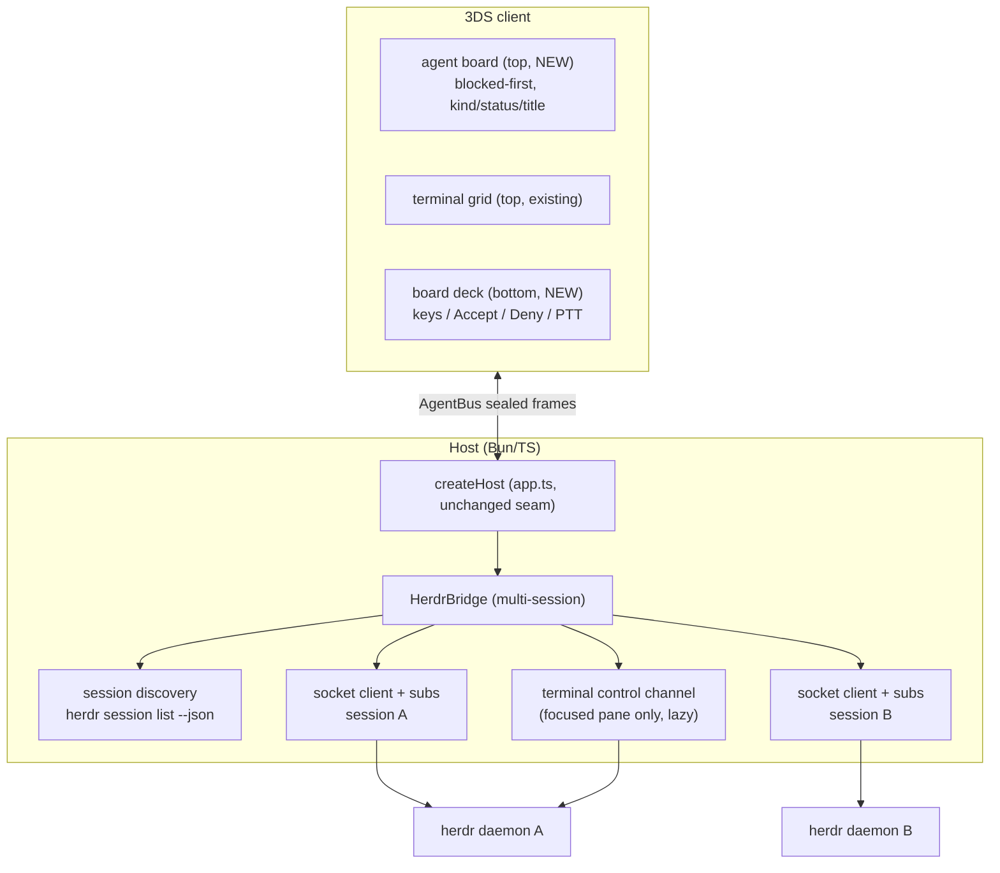
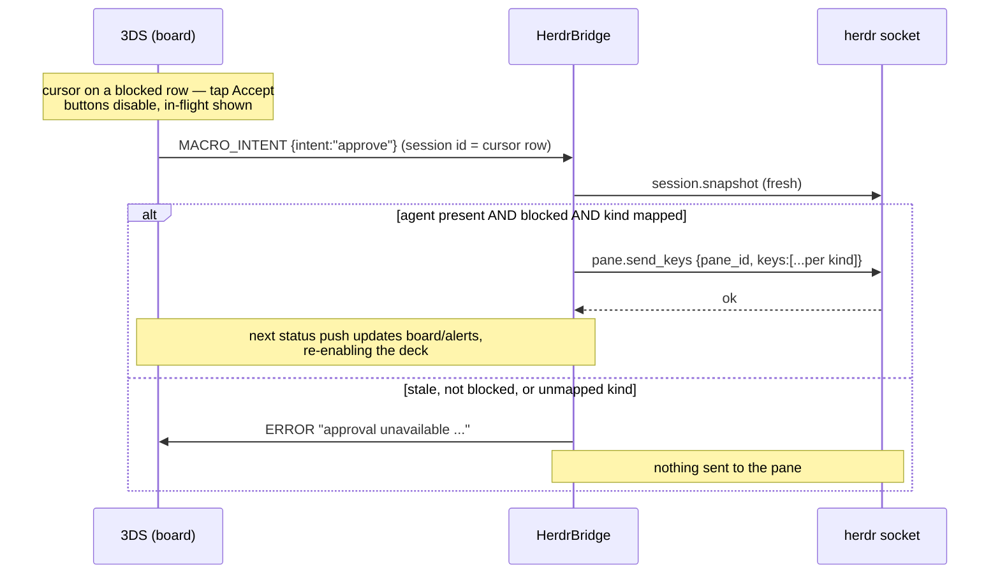

# refactor: reorient 3DSendai around herdr agent supervision (agentslate port)

## Summary

Reorient 3DSendai from terminal-first to agent-supervision-first by porting the Herdr integration semantics of [AgentSlate](https://github.com/DanielOu1208/agentslate) (MIT, Daniel Ou) onto our stack. The 3DS gains an agent board: every agent pane across every running herdr session, blocked agents first, with kind, task title, workspace, and semantic state — plus one-tap watched-screen Accept/Deny mapped per agent kind, and the terminal drop-in AgentSlate deliberately lacks. The AgentBus sealed transport, Bun/TS host, and C client stay; herdr becomes the default backend; tmux and the structured agent stack remain selectable and untouched.

**Ported from agentslate** (semantics, revalidated against captured fixtures per AGENTS.md invariant #8): multi-session discovery via `herdr session list --json`, snapshot agent normalization (`kind`/`name`/`status`/`title`/`workspace`), the watched-screen approval model (fresh-snapshot revalidation, blocked-only gating, per-kind key sequences), and the blocked-first dashboard ordering. **Not ported**: Tailscale transport, pairing codes (we keep PSK + QR), 200 ms polling (we keep event subscriptions), on-device speech (we keep host STT), terminal removal (our terminal is the differentiator).

**Wire discipline:** zero new message types, zero renumbering. `SessionSummary` gains optional fields old clients ignore; the dormant `MACRO_INTENT` (70) frame gets its first real consumer.

---

## Problem Frame

3DSendai's terminal mode answers "show me this session's bytes." The user's actual supervision loop — which of my agents needs me, approve or deny the blocked one, glance at the rest — is what AgentSlate built for the iPhone, and it is the product Jordan wants on the 3DS ("use his entire Herdr integration and just port it to what we need").

Today's gaps, from repo research:

- The host's herdr bridge attaches to **one** daemon socket; AgentSlate spans every running named session.
- Agent metadata is squeezed into a 40-char label; `SessionSummary.status` crosses the wire but **the client discards everything except the name** (`client/source/main.c` parses only `name`). No top-screen view exists other than the terminal grid.
- Approvals in bridge mode are blind `y\r` keystrokes from a compiled-in pad — no per-kind mapping (Claude Code needs Enter/Escape, not y/n), no blocked-state gating, no host-side revalidation.
- The herdr wire facts are pinned at 0.7.2; local herdr is 0.7.3, whose schema adds `session.snapshot` `agents[]`/`workspaces[]` arrays, `pane.send_keys`, a real `done` status, and seen-on-refocus semantics.

AgentSlate's transport (plain NDJSON over Tailscale) cannot work on a 3DS — no Tailscale client, no TLS stack worth trusting — which is exactly what our sealed AgentBus transport is for. So the port is semantics into our host + device, not architecture adoption.

---

## Requirements

- **R1. Multi-session discovery.** The host enumerates running herdr sessions via `herdr session list --json` (running filter, default first, then alphabetical), attaches to each session's socket, and re-enumerates on an injected schedule and on daemon loss. `SENDAI_HERDR_SESSION` / `SENDAI_HERDR_SOCKET` restrict to a single explicit target as today. Discovery succeeding with zero running sessions is an empty board plus a startup log hint, not an error; a missing `herdr` binary or failed discovery is the R8 clear-error path.
- **R2. Agent-first board data.** Every herdr agent pane reaches the device as a `SESSION_STATE` entry enriched with optional `kind` (stable agent identifier, e.g. `codex`), `agentName` (short display name), `title` (task title, falling back through herdr's title fields), and `workspace` (label); `status` carries the semantic mapping (herdr `working`→`running_tool`, `blocked`→`blocked`, `done`→`done`, `idle`→`idle`, unrecognized→`unknown`). All four new fields pass the host's existing `sanitizeLabel` control-byte-stripping discipline before emission — they are process-controlled strings feeding an approval surface. The existing `agent` label field keeps its decorated form (now with session context when more than one herdr session is live); no `name` key is ever emitted (old clients parse `name` preferentially and their picker labels would collapse). Old clients ignore all new keys; no new message types.
- **R3. Device agent board.** The 3DS gains its first top-screen mode besides the terminal: an agent board listing agents blocked-first (stable within groups) with kind, name, status, and title, capped at 16 rows with a blocked-preferring eviction policy and a cursor-following scroll viewport (the 240 px top screen shows ~9 rows at the existing row-height convention). The D-pad moves a selection cursor **tracked by session id, not row index** — a live re-sort or row removal never silently retargets it (nearest-row fallback on removal). Row activation (A) sends `FOCUS_SESSION` and drops into the terminal; one toggle returns. The board is the unconditional top-screen mode at attach for every backend — tmux/agents rows render sparsely (name + status, no kind/title) — and board state derivation is pure C and host-KAT covered.
- **R4. Watched-screen approvals.** In board mode the device offers Accept/Deny for the **cursor row**, enabled only when that row's `status` is `blocked` and its kind is in the compiled five-kind allowlist (cosmetic gate). The tap sends `MACRO_INTENT` `approve`/`reject` carrying the cursor row's session id explicitly (the same session-targeting idiom `KEYSTROKE` uses) — no `FOCUS_SESSION` round-trip, no focus change. The herdr bridge revalidates against a **fresh snapshot** (agent present AND `blocked` AND kind has a mapping) and sends the per-kind sequence in one herdr request — `codex`/`cursor` → `y`/`n`, `claude`/`omp` → enter/esc, `opencode` → enter / esc-then-enter — else emits `ERROR` and sends nothing. The gate narrows but cannot close the race between snapshot and send (herdr has no atomic approve-iff-blocked primitive); that residual window is accepted watched-screen semantics. On tap the device disables both buttons and shows an in-flight state until the next status update for that row or a short cooldown — a double-tap must not send twice. `APPROVAL_REQUEST`/`APPROVAL_RESPONSE` stay reserved for the structured live-approval tier (blocked status is not authorization evidence — carried from agentslate's own research).
- **R5. Keypad continuity.** The board deck's key bank (arrows, Enter, Escape, Tab, Shift+Tab, Space) and push-to-talk act on the **focused** agent's terminal control channel and render disabled until a session is focused; the D-pad in board mode moves the cursor, never sends keystrokes. Keys ride the existing `KEYSTROKE` raw-byte path (Shift+Tab is `ESC [ Z`); no socket key-name mapping is introduced for the keypad. Voice continues through the existing transcript→keystroke route unchanged.
- **R6. Availability isolation.** Each discovered session bootstraps independently: one stale socket at startup emits one `ERROR` naming that session while the healthy subset's board comes up, and the failed session retries on the re-enumeration schedule. One daemon dying after attach ends only its panes (existing `session_ended` + `ERROR` semantics, now per session); a later successful re-enumeration restores the lost session's panes under fresh device ids.
- **R7. Fixture refresh and pin bump.** Wire facts re-captured against herdr 0.7.3 (scratch named session, scrubbed, per the fixtures README procedure) after a spike-day release check; the pin note and U3/U4-era suites updated. herdr 0.7.2 and 0.7.3 both speak socket protocol 16, so the pin is documentation plus capability errors, not protocol-number enforceable — an older daemon surfaces at the first `pane.send_keys` as a targeted upgrade-hint `ERROR`, and the snapshot parser keeps a pane-derived fallback shape. New captures: `session list --json`, snapshot `agents[]`/`workspaces[]`, `pane.send_keys` (including `y`, `n`, multi-key `esc`+`enter`, and whether `shift+tab` is a valid key name at 0.7.3), how session-qualified CLI invocations address the **default** session (its socket lives at the top-level path, not under `sessions/<name>/`), and seen-on-refocus. `done` is **not** reportable via `pane.report_agent` (its input enum excludes it, same as 0.7.2) — it stays synthesized in tests shaped on captured pushes unless a real agent integration produces it during capture. agentslate's code is treated as a hypothesis about the wire, never as ground truth.
- **R8. Product reorientation.** `SENDAI_BACKEND` unset now selects herdr; `agents` and `tmux` remain explicit values and `SENDAI_TMUX=1` keeps working; herdr absent/unreachable at start surfaces the existing clear-`ERROR`-never-hang behavior with a pointer to the escape hatches. README, CONCEPTS.md, PROTOCOL.md, **and the AGENTS.md/CLAUDE.md product-identity preambles** describe the agent-supervision identity; attribution for the port is recorded.
- **R9. Compatibility and invariants.** No new message types, no renumbering, additive-only payload changes; existing golden vectors byte-identical, new coverage additive; codegen untouched or drift-gate clean; C KATs green; devkitARM build clean and warning-free; a pre-refactor client binary still attaches and drives terminal mode against the new host with unchanged picker labels.
- **R10. Verification.** Fixture-grounded socket/bridge suites, client KATs for the board model and enriched parsing, e2e through the real sealed server asserting no cleartext, and skipIf live tests against a scratch daemon.

---

## Key Technical Decisions

- **Port semantics, keep architecture.** AgentSlate's Rust bridge + Tailscale + NDJSON protocol v3 are replaced by our existing host + sealed AgentBus; what transfers is its herdr API usage (`session list --json`, snapshot normalization, `pane.focus`/`pane.send_keys`/`pane.send_input`, narrow method surface) and its supervision model (blocked-first, watched-screen approvals, availability semantics). Its 200 ms per-client polling is *not* ported — our event-subscription bridge is strictly better and already fixture-proven.
- **Zero new frame types.** `SessionSummary` (protocol/src/messages.ts, hand-written, not generated) gains optional `kind`/`agentName`/`title`/`workspace` strings and an `unknown` status union member. The frame codec treats payloads as canonical JSON, so existing golden vectors stay byte-identical; one additive vector case documents the enriched shape. `MACRO_INTENT` (70) — minted, golden-vectored, and routed nowhere today — becomes the approval-action vehicle in herdr bridge mode. This is the R7-of-plan-005 discipline extended: spend dormant vocabulary before minting codes (next free would be down 13 / up 74 — note AGENTS.md says 73, which CLIENT_SIZE already took; fix in U8).
- **Approvals are macropad intents targeting the cursor row, not approval-protocol frames.** herdr's `blocked` has no request identity (no approvalId, tool, or detail), and agentslate's research is explicit that blocked status is not authorization evidence. Overloading `APPROVAL_REQUEST`/`APPROVAL_RESPONSE` would conflate the live-approval tier (CONCEPTS.md) with a watched-screen convenience. The intent frame carries its target session id explicitly — approval never depends on, or changes, terminal focus, which both preserves the one-tap loop and removes the highlight-one-approve-another hazard. The authoritative gate is host-side fresh-snapshot revalidation; the device's enable/disable is cosmetic — exactly agentslate's split between phone UI gating and bridge revalidation.
- **Terminal channels open on focus, not attach.** Today the bridge opens the focused pane's control channel eagerly, and the channel `--takeover`s the pane and resizes its real PTY to device size — correct for a terminal-first product, wrong for one where attaching means glancing at a board. Channels become lazy: opened on `FOCUS_SESSION`, re-opened by `resync()` only when one was already open, never at bootstrap; no pane is focused host-side at attach. The keypad stays raw bytes through the focused channel (Shift+Tab is `ESC [ Z` — no dependency on herdr key names). The only socket input paths added are the approval sequences (`pane.send_keys`, one request per action, key names verified at capture) — and they must be socket-side, because they are kind-mapped, revalidated, and focus-independent.
- **Flattened board, not a session picker.** Device sessions already are herdr panes; multi-session support flattens all running daemons' panes into one board with session context in labels. A two-level session→agent navigation on a 3DS would cost more than it buys; agentslate's phone-local session picker exists because its sessions are the unit of connection, ours aren't.
- **Blocked-first ordering is device-side.** `SESSION_STATE` updates arrive incrementally; ordering is a presentation concern over the device's current set. A pure-C stable sort (blocked first) in the board model is KAT-testable and robust to update order, and keeps the host emitting state, not presentation.
- **Pin herdr 0.7.3 (installed), tolerate 0.7.4 additively.** The 0.7.3 schema (verified via `herdr api schema --json`) already has `session.snapshot` `agents[]`/`workspaces[]`, `pane.send_keys`, and all five agent statuses including a real `done`. agentslate's 0.7.4 floor buys `terminal_title_stripped` (optional in our normalization) and better blocked detection — daemon-side improvements we inherit for free when the user upgrades (README recommends 0.7.4+). `parseSnapshot` keeps its pane-derived path as the fallback shape and treats `agents[]` as the enrichment source, so a 0.7.2-shaped snapshot still degrades gracefully.
- **Default backend flips to herdr.** "Fundamentally refactor around agent supervision" means the flagship path is the default. `resolveBackend` unset → `herdr` (today: `agents`); every existing explicit selection keeps working; the missing-herdr failure mode is the already-designed clear `ERROR`, now with the escape hatches named. Demotion of tmux and the structured stack is documentation and default only — no code removed.
- **Attribution follows the vendor-record convention.** Ported logic (normalization precedence, approval keymaps, discovery ordering) is a semantics translation, not vendored files, so it gets `host/src/herdr/AGENTSLATE-PORT.md` (source URL + commit, MIT text pointer, what was ported, GPL-3.0 compatibility statement, and which keymaps ship on agentslate's evidence vs. local capture) plus file-header citations — the lighter sibling of `MONOCYPHER-VENDOR.md`. herdr itself stays unvendored (AGPL-3.0; we remain an external socket client).

---

## Assumptions

Made headlessly (pipeline mode, no synchronous user); each is cheap to redirect at PR review.

- **Herdr becomes the default backend** (R8). The alternative — keep `agents` default and make herdr opt-in — contradicts "fundamentally refactor." All prior launch invocations keep working via explicit env.
- **The board is the attach-time top-screen default for every backend.** The client is backend-agnostic by design and cannot know which backend is speaking; tmux/agents rows render sparsely (name + status, no kind/title/workspace). The named alternative for redirect: keep today's terminal-first landing and enter the board by toggle.
- **Flattened multi-session board** with labels carrying session context, rather than a session-picker level (see KTD). Board cap 16 rows with blocked-preferring retention and a scroll viewport; terminal slots stay at 8 with reclamation on session end.
- **Accept/Deny stays the five-kind allowlist** agentslate validated (`codex`, `cursor`, `claude`, `omp`, `opencode`) — unmapped kinds get no approval buttons rather than guessed keystrokes.
- **`MACROPAD_LAYOUT` stays dormant.** The board's bottom deck is compiled-in like the existing pad; host-pushed layouts would require the naive device JSON scanner to grow array parsing — deferred with the other layout-push work.
- **Voice path unchanged** (transcript → keystroke into the focused channel); a socket `send_input {text, keys:[enter]}` voice route is deferred until evidence it beats typing into the pane.
- **The structured agent stack (adapters/registry/policy/capability) is untouched** — demoted in docs, not in code.

---

## High-Level Technical Design

Component topology — one host process, N herdr daemons, flattened device board:

Watched-screen approval flow (R4):

Concept mapping (agentslate → 3DSendai):

| agentslate | 3DSendai |
|---|---|
| Herdr session (named daemon) | discovered socket target; label context on the board |
| agent (normalized pane) | device session (`SESSION_STATE` entry) with `kind`/`agentName`/`title`/`workspace` |
| blocked-first dashboard | device-side pure-C board sort |
| `send_action` accept/deny | `MACRO_INTENT` `approve`/`reject` on the cursor row + host revalidation |
| `send_key` allowlist | existing `KEYSTROKE` raw bytes via the focused control channel |
| `send_text` (voice) | existing transcript→keystroke route (unchanged) |
| `herdr_state` connected/unavailable | per-daemon `session_ended`/`ERROR` isolation |
| Tailscale + pairing codes | existing PSK sealed transport + QR pairing |

---

## Implementation Units

### U1. Spike-day release check + fixture refresh at herdr 0.7.3

- **Goal:** Re-ground every herdr wire fact this plan depends on at the installed 0.7.3, before any code changes.
- **Requirements:** R7 (grounds R1, R2, R4)
- **Dependencies:** none
- **Files:** `host/test/fixtures/herdr/` (recaptured + new `.ndjson`, README pin + facts), `docs/plans/fable-lessons.md` (append deltas worth keeping)
- **Approach:** First re-read herdr's release feed/changelog for anything ≥ 0.7.3 that changes this plan (the 0.7.2 lesson: check *before* executing the researched design). Then capture against a scratch named session (`herdr --session 3dsendai-spike server`), never the user's default socket, scrubbing per the README procedure. Recapture the existing flows (bootstrap, snapshot, subscribe, send-input, terminal control, contention) plus new captures: `herdr session list --json` CLI output (running and stopped sessions — a multi-running capture needs a second scratch daemon); populated `session.snapshot` showing `agents[]`/`workspaces[]` and per-pane fields (`agent`, `agent_status`, `display_agent`, `title`, `cwd`); `pane.send_keys` happy path and rejection; key-name validity for `y`, `n`, `esc`, `enter`, multi-key `["esc","enter"]` in one request, and `shift+tab`; **how session-qualified CLI invocations address the default session** (its socket is the top-level `~/.config/herdr/herdr.sock`, not `sessions/default/` — verify whether `--session default` reaches it or the flag must be omitted, and record the rule U4's spawn logic follows); seen-on-refocus behavior; one-request-per-connection and subscribe semantics re-verified. `done` is not reportable via `pane.report_agent` (input enum: idle|working|blocked|unknown, unchanged from 0.7.2) — attempt a `done` transition only via a real agent integration in the scratch pane, else keep it synthesized in tests per the existing discipline and record that in the README. Update the README pin (0.7.3, protocol 16, capture date) and re-run the existing herdr suites against refreshed fixtures.
- **Execution note:** Fixture-first discipline — later units build parsers from these captures, never from agentslate's code or herdr's docs.
- **Test scenarios:** Test expectation: none — exploratory capture; deliverables are scrubbed fixtures, the updated pin, and a recorded facts list (key-name validity incl. `shift+tab` and single-char names, default-session addressing rule, done/seen behavior as observed).
- **Verification:** Existing `host/test/herdrSocket.test.ts` / `herdrBridge.test.ts` suites green against refreshed fixtures (adjusted only where a captured fact genuinely changed); README records the new pin and the 0.7.2→0.7.3 deltas.

### U2. Host: herdr session discovery

- **Goal:** Enumerate running herdr sessions the way agentslate does, as an injectable, fixture-tested unit.
- **Requirements:** R1
- **Dependencies:** U1
- **Files:** `host/src/herdr/discovery.ts` (new), `host/test/herdrDiscovery.test.ts` (new)
- **Approach:** A factory wrapping `herdr session list --json` behind an injected exec seam (array-form spawn, matching the existing runner convention — no shell interpolation): parse `{sessions:[{name, default, running, socket_path}]}` tolerantly (unknown fields ignored), filter running with non-empty names, order default-first then alphabetical (ported ordering — cite agentslate in the header). Expose a re-enumeration schedule via injected `schedule`/`cancel` timers (matching the bridge's timer-seam convention) and an on-demand refresh for daemon-loss. Resolution precedence: `SENDAI_HERDR_SOCKET` or `SENDAI_HERDR_SESSION` set → single-target mode, discovery disabled (today's behavior); otherwise discovery mode. Zero running sessions is a valid empty result (empty board + log hint downstream); missing `herdr` binary or malformed output → typed error, never a hang.
- **Patterns to follow:** `host/src/herdr/socket.ts` injected-dial + typed-error style; `host/src/tmux/runner.ts` subprocess seam.
- **Test scenarios:** Running/stopped filtering and default-first ordering against the U1 CLI fixture (mirrors agentslate's `parses_running_sessions_default_first`); empty session list yields empty result, not an error; malformed JSON and non-zero exit produce the typed error; unknown fields in a session entry are ignored; single-target env vars suppress discovery; scheduled re-enumeration fires through the injected timer and stops on dispose.
- **Verification:** New suite green; `bun run typecheck` green.

### U3. Protocol: enrich `SessionSummary` (no new frame types)

- **Goal:** Give the board its data fields with strictly additive wire changes.
- **Requirements:** R2, R9
- **Dependencies:** none (parallel with U1/U2)
- **Files:** `protocol/src/messages.ts`, `protocol/test/generateGolden.ts` + `protocol/test/golden/vectors.json` (one additive case), `docs/PROTOCOL.md` (field notes)
- **Approach:** `SessionSummary` gains optional `kind?`, `agentName?`, `title?`, `workspace?` strings; `status` union gains `"unknown"`. The short display name rides `agentName`, **never a `name` key** — the pre-refactor client parses `name` preferentially over `agent`, so emitting `name` would collapse old pickers to bare short names and break R9's unchanged-labels guarantee; `agent` keeps the decorated label for old clients. Emitters are untouched in this unit. Regenerate `vectors.json` via the generator and confirm every pre-existing vector is byte-identical (the codec is shape-agnostic; only the appended case is new). No codegen run needed (message-types source untouched) — CI's drift gate proves it.
- **Test scenarios:** Golden suite passes with the new case; a diff of `vectors.json` shows additions only; `frames.test.ts` round-trips a `SESSION_STATE` payload carrying the new fields; a payload omitting them still type-checks at every `satisfies SessionSummary` site.
- **Verification:** `bun test` + `bun run typecheck` green; `bun run codegen && git diff --exit-code` clean.

### U4. Host: multi-session HerdrBridge with enriched board emission

- **Goal:** One `HerdrBridge` spanning every discovered session, emitting the enriched board, with lazy terminal channels and per-daemon isolation.
- **Requirements:** R1, R2, R6
- **Dependencies:** U1, U2, U3
- **Files:** `host/src/herdr/bridge.ts`, `host/src/herdr/runner.ts`, `host/test/herdrBridge.test.ts`, `host/test/fixtures/herdr/` (from U1)
- **Approach:** The runner seam is redesigned for multi-target: the bridge takes an injected factory `makeRunner(target: {session?, socketPath})` (dial via the existing `herdrDialer`; `spawnControl` session-qualified per the U1-captured default-session addressing rule), with a back-compat single-target construction so `host/bin/host.ts` compiles unchanged until U8 wires discovery. The bridge owns a map of session-name → socket client + subscriptions, built from U2 discovery (or the single explicit target); **each session bootstraps independently** — a per-session bootstrap failure emits one `ERROR` naming the session, the board comes up with the successful subset, and the failed session retries on the re-enumeration schedule. Pane bookkeeping becomes (session, pane_id) → device id; device ids still never reused. Normalization ports agentslate's precedence — `kind` = pane `agent`, `agentName` = `display_agent` ?? `agent`, `title` = `title` ?? `terminal_title_stripped` (absent at 0.7.3 — tolerated optional), `workspace` = workspace label joined by id — sourced from the U1-captured snapshot shape with the pane-derived path as fallback. **All four fields pass `sanitizeLabel` (control/escape bytes stripped, length-capped) before `SessionSummary` emission** — pane titles are process-controlled and feed the approval surface. `status` maps herdr states with unrecognized → `"unknown"`; labels gain a `<session>/` prefix only when >1 session is attached. **Terminal channels go lazy:** no channel and no host-side `pane.focus` at bootstrap; `FOCUS_SESSION` opens the channel (focus + spawn against the right daemon); `resync()` re-opens only a channel that was already open, so a device attaching to glance at the board never `--takeover`s or resizes a desktop pane. Keystroke/resize behavior through an open channel is unchanged. Alert semantics (blocked→attention, done→likely_done, exit→session_ended, plan-005's R11 re-derive on resync) unchanged and now per-session.
- **Patterns to follow:** Existing `bridge.ts` phase machine, pendingOps queueing, channel-instance output binding, `stripOsc`, alert dedupe; test fakes shaped on fixtures per `host/test/herdrBridge.test.ts` conventions.
- **Test scenarios:** Two fake daemons enumerate into one board with session-prefixed labels; single-daemon mode emits unprefixed labels (back-compat); enriched fields flow into `SESSION_STATE` payloads (kind/agentName/title/workspace present when the fixture provides them, absent otherwise) and control bytes embedded in a fixture pane title are stripped before emission; unrecognized `agent_status` maps to `unknown`; **daemon B unreachable at startup — A's panes still enumerate, one `ERROR` names B, a later refresh attaches B**; daemon A's socket drop after attach ends only A's panes (B's stay live, no board wipe), emits `ERROR` once, and a discovery refresh re-attaches A's panes under fresh ids; bootstrap opens no channel and issues no `pane.focus`; `FOCUS_SESSION` opens the channel against the right daemon and a repaint precedes streaming; `resync()` before any focus re-emits the board without opening a channel; status transitions still alert once per transition and re-derive on resync; pre-bootstrap `route`/`resync` still queue.
- **Verification:** Bridge suite green against U1 fixtures; `bun run typecheck` green.

### U5. Host: watched-screen approvals via `MACRO_INTENT`

- **Goal:** Port agentslate's accept/deny model as the herdr bridge's first `MACRO_INTENT` consumer, targeted by the routed session id.
- **Requirements:** R4
- **Dependencies:** U1, U4
- **Files:** `host/src/herdr/approvals.ts` (new — pure mapping + gate), `host/src/herdr/bridge.ts` (route wiring), `host/src/herdr/AGENTSLATE-PORT.md` (new), `host/test/herdrApprovals.test.ts` (new), `host/test/herdrBridge.test.ts` (route cases)
- **Approach:** `approvals.ts` holds the ported kind→sequence table (`codex`/`cursor` → `["y"]`/`["n"]`; `claude`/`omp` → `["enter"]`/`["esc"]`; `opencode` → `["enter"]`/`["esc","enter"]`; key names as verified in U1 — if single-char names are invalid at 0.7.3, the fallback is `pane.send_input` `{text:"y"}` for the y/n kinds, decided by capture evidence) and the gate predicate (present + `blocked` + mapped). `bridge.route(MACRO_INTENT, sessionId)` accepts only `approve`/`reject` and **resolves the target from the routed session id** — the device's cursor row, independent of focus state: fetch a **fresh** snapshot from that session's socket, apply the gate, send one `pane.send_keys` request on pass; on fail emit `ERROR` with a reason (`stale agent`, `not blocked`, `no mapping for <kind>` — the interpolated kind passes the same sanitization as board fields) and send nothing. An unknown-method/`invalid_request` rejection of `pane.send_keys` (a pre-0.7.3 daemon — protocol 16 is shared, so this is the only detection point) emits a targeted `ERROR` naming the requirement ("approvals need herdr ≥ 0.7.3"). Other herdr-call failures surface as `ERROR` too — acknowledged only after herdr accepts, per agentslate. The snapshot-to-send window stays open by herdr API design; document it in the file header. Unknown intents stay dropped (bridge discipline). Record the port provenance in `AGENTSLATE-PORT.md`, including which kind mappings were capture-verified locally vs. shipped on agentslate's evidence (kinds not installed during U1).
- **Patterns to follow:** Pure-function + injected-client test style of `socket.ts`; the approval-timeout idempotence lesson (guard any once-only bookkeeping against double fire).
- **Test scenarios:** Each of the ten kind×action mappings issues exactly the expected key sequence in one request (mirrors agentslate's table test); approve targets the routed session id's pane even when a different session is focused; approve for a `working` agent → `ERROR`, zero socket input calls; approve for a kind without a mapping (e.g. `gemini`) → `ERROR` naming the kind; approve for a stale/unknown session id → dropped or `ERROR` without a snapshot call (match existing stale-id discipline); fresh-snapshot race — agent unblocks between the device tap and the snapshot → `ERROR`, nothing sent; snapshot fetch failure → `ERROR`, nothing sent; `send_keys` unknown-method rejection → the upgrade-hint `ERROR`; other `send_keys` rejection propagates as generic `ERROR`; a non-approval intent is ignored.
- **Verification:** New suite + bridge route cases green; typecheck green.

### U6. Client: board model (pure C) + enriched `SESSION_STATE` parsing

- **Goal:** The device-side data model for the board — ordering, cursor identity, viewport, slot lifecycle — host-KAT covered before any rendering exists.
- **Requirements:** R3, R9
- **Dependencies:** U3 (field names)
- **Files:** `client/source/board.h`, `client/source/board.c` (new, pure C, no libctru), `client/test/boardTest.c` (new), `client/source/main.c` (parse + feed + slot lifecycle), `client/test/run.sh` (add `board.c` to the KAT compile list **and** `board` to the `-Werror` first-party loop)
- **Approach:** `ab_board` fixed-capacity model (16 rows): `{session_id, name[32], kind[16], status[16], title[40], workspace[24], used}` with bounded copies; upsert keyed by session id; removal on session end; stable blocked-first ordering exposed as an index array (insertion order preserved within groups); eviction on overflow prefers dropping non-blocked rows. **Cursor identity:** the model tracks the selected session id (not a row index) and exposes resolve-to-row plus nearest-row fallback when the selected row disappears — a live re-sort never retargets the cursor. **Viewport:** a cursor-following scroll window over the ordered rows (visible-count supplied by the caller; ~9 rows at the UI's row height) with clamped bounds. **Deck predicates live here for KAT coverage:** approval enablement (cursor row blocked + kind in the compiled five-kind allowlist + no approval in flight), key-bank enablement (a session focused), and the in-flight/cooldown bookkeeping for Accept/Deny (armed on tap, cleared by a status update for that row or an injected-time cooldown — idempotent under double fire, per the approval-timeout lesson). `main.c`: the `SESSION_STATE` handler extends its existing `json_get_string` calls to `kind`/`agentName`/`status`/`title`/`workspace` (all optional — absent keys leave empty strings; the naive scanner requires unique keys per payload, which holds; row primary text is `agentName` falling back to the parsed `agent`/`name` label exactly as today). **Slot lifecycle:** the `ALERT_SIGNAL` `session_ended` handler removes the board row **and frees the matching `g_sessions` terminal slot** (today nothing ever clears `used`, so 8 lifetime ids exhaust the table — with fresh-id re-enumeration churn that is a same-day failure); `HELLO` clears board and slots alongside the picker (re-enumeration).
- **Patterns to follow:** `client/source/alert.h`/`approval.h` pure-C ring/queue style (`ab_` prefix, `s_` statics, fixed buffers, negative-int errors); KAT conventions of `alertlogTest.c`.
- **Test scenarios:** Upsert inserts then updates in place (no duplicate rows per session id); blocked rows order before non-blocked regardless of arrival order, ties keep insertion order; a row transitioning blocked→working re-sorts down, working→blocked re-sorts up; cursor keeps its session id across a re-sort (row index changes, identity doesn't); cursor on a removed row falls to the nearest row; viewport follows the cursor to keep it visible and clamps at both ends; removal compacts; 17th row evicts a non-blocked row, never a blocked one (and is refused when all 16 are blocked); slot lifecycle — session ids churning past 8 reuse freed slots after `session_ended`, and `HELLO` resets all slots; approval enablement true only for (cursor-on-blocked-row, allowlisted kind, not in flight) and arming it disables further sends until cleared by status update or cooldown, exactly once under double fire; key-bank predicate false until a session is focused; name/kind/title/workspace truncate safely at their caps with valid NUL termination; absent optional fields yield empty strings; payload missing `status` defaults to a non-blocked state.
- **Verification:** `client/test/run.sh` green (new KAT included, grep for its binary in the output, not just tail); `-Werror` first-party gate covers `board`.

### U7. Client: board UI mode + agent deck

- **Goal:** Render the board and its bottom-screen deck; wire touch and buttons; keep the terminal one toggle away.
- **Requirements:** R3, R4 (device half), R5
- **Dependencies:** U6
- **Files:** `client/source/ui.c`, `client/source/ui.h`, `client/source/main.c`; devkitARM rebuild
- **Approach:** One coupled mode axis: **board mode** (top: board list; bottom: board deck) vs **terminal mode** (top: terminal grid; bottom: existing control-strip/macropad/alerts cycle) — a single toggle switches both screens together; the two are never mixed. Board is the unconditional top-screen mode at attach for every backend; the existing auto-focus-first-session call in the `SESSION_STATE` handler is **gated to terminal mode** so the board holds as the landing (and no herdr pane gets focused as a side effect of attaching). Board rendering: rows from `ab_board` order through the U6 viewport (kind tag — blank for rows without one — name, status text with `running_tool` displayed as "working" and `blocked` highlighted, title truncated); empty board renders a placeholder ("no agents yet") matching the existing empty-state convention; D-pad moves the identity-tracked cursor; **A = `FOCUS_SESSION` on the cursor row + switch to terminal mode; B = back to board (B is the sole back binding — START remains the app's unconditional quit and must not be rebound)**. Board deck: Accept/Deny driven entirely by the U6 predicates (enabled only for a blocked, allowlisted cursor row; disabled + "sending…" while in flight), sending `MACRO_INTENT` `{intent:"approve"|"reject"}` with the cursor row's session id — no focus change; key bank (arrows/Enter/Esc/Tab/Shift+Tab as raw byte sequences through the existing `KEYSTROKE` path — Shift+Tab is `ESC [ Z`) and PTT rendered disabled until a session is focused; the deck's control count exceeds the old 8-button pad budget, so the layout may split banks across rows — implementer's call within the existing geometry/hit-range conventions (new touch ranges get a new `AB_HIT_*` base constant). Alert-log behavior is unchanged: alert-row taps keep their existing mute-toggle semantics (no alert→focus gesture exists today; adding one is deferred) — blocked-first board ordering is the attention surface. Render/touch glue carries the `COMPILES with devkitPro; runtime UNVERIFIED without hardware` header; every pure decision (predicates, display-string mapping, viewport) lives in `board.c` where U6's KATs cover it. Smoke-check that a pending structured `APPROVAL_REQUEST` overlay (which claims A/B while non-empty) composes sanely over board mode — its A/B precedence is pre-existing behavior.
- **Patterns to follow:** `ui.c` mode dispatch + `ui_hit_bottom` base-offset hit testing; `main.c` `handle_touch`/`handle_buttons` structure; libctru header non-transitivity.
- **Test scenarios:** Pure parts only (in `boardTest.c`, per U6): enablement predicates, display mapping incl. `unknown`, Shift+Tab byte sequence `1B 5B 5A`, viewport behavior. Render/touch behavior: Test expectation: none — libctru glue, runtime-unverified without hardware; held to warning-free build + clang-tidy instead.
- **Verification:** Clean devkitARM `make` (docker), `client/tools/lint.sh` clean, `client/test/run.sh` green.

### U8. Backend default flip, config, docs, attribution

- **Goal:** Make herdr the product default and tell the truth about it everywhere.
- **Requirements:** R8, R9 (docs half)
- **Dependencies:** U4, U5
- **Files:** `host/src/backend.ts`, `host/bin/host.ts` (header comment + discovery wiring), `host/test/backendConfig.test.ts`, `README.md`, `CLAUDE.md`, `CONCEPTS.md`, `AGENTS.md`, `docs/PROTOCOL.md`, `host/src/herdr/AGENTSLATE-PORT.md` (from U5), `host/test/fixtures/herdr/README.md` (pin, from U1)
- **Approach:** `resolveBackend`: unset → `herdr`; `agents` becomes an explicit value; `SENDAI_TMUX=1` alias and the herdr/tmux contradiction fatal stay; startup log names the backend and, when herdr is default-selected but unreachable, the `ERROR` message points at `SENDAI_BACKEND=tmux|agents`; discovery-mode zero-running-sessions logs the empty-board hint rather than erroring. README reorients: agent-supervision identity first (board, approvals, drop-in terminal), agentslate credit + link, herdr quickstart (0.7.3 minimum, 0.7.4+ recommended for better blocked detection), tmux/agents as alternate backends, the watched-screen safety caveat (approvals are conveniences for a visible screen, not structured authorization — echo Daniel's warning), and the status section keeps the hardware-proven vs runtime-unverified split with the board marked build-clean/host-verified but awaiting on-device mileage. **AGENTS.md and CLAUDE.md product-identity preambles are rewritten to the agent-supervision identity** (both currently open with "remote terminal + macropad for your own tmux sessions"); AGENTS.md also gets the herdr pin reference 0.7.3 and the corrected next-free note (up is 74 — 73 is CLIENT_SIZE). CONCEPTS.md gains `Agent board`, `Agent kind`, and `Watched-screen approval`; the herdr-bridge entry updates for multi-session + lazy channels. PROTOCOL.md documents the enriched `SessionSummary` fields and `MACRO_INTENT`'s herdr-mode meaning.
- **Test scenarios:** `resolveBackend` unset → herdr; `SENDAI_BACKEND=agents` → agents; `SENDAI_TMUX=1` alone → tmux; `SENDAI_BACKEND=herdr` + `SENDAI_TMUX=1` → fatal (unchanged); invalid value → fatal naming the valid set.
- **Verification:** Config suite green; docs match shipped env names; a grep for both "tmux is the default" phrasing **and** "remote terminal + macropad for your own tmux sessions" finds no stale survivors.

### U9. End-to-end and live verification

- **Goal:** Prove the flattened board, cursor-targeted approvals, and isolation through the real sealed server, and against a real daemon when present.
- **Requirements:** R10, R6, R9
- **Dependencies:** U4, U5 (U7 for byte-vocabulary consistency checks only)
- **Files:** `host/test/e2eHerdr.test.ts`, `host/test/herdrLive.test.ts`
- **Approach:** e2e extends the existing fake-daemon-under-real-sealed-server harness: two fake daemons, a hand-built secure device asserting the enriched board arrives (kind/agentName/title/workspace + session-prefixed labels), a `MACRO_INTENT` approve carrying a non-focused session id driving the fresh-snapshot → `send_keys` flow into the right fake daemon, the not-blocked race returning `ERROR` with no input call, one daemon dropping without ending the other's sessions, attach-without-focus opening no control channel, and the standing no-cleartext-on-the-raw-wire assertion. Live test extends `herdrLive.test.ts` (skipIf no herdr): scratch session, a pane driven to `blocked` via `pane.report_agent`, a real approve round-trip (send_keys accepted), `session list --json` discovery seeing the scratch session, full teardown on failure. A back-compat case: a device simulating yesterday's parser (reads `name` falling back to `agent`, ignores unknown keys) still renders today's decorated labels — enriched payloads are valid supersets and no `name` key appears in them.
- **Test scenarios:** As enumerated in Approach — each is one test case; plus reconnect resync re-delivers the enriched board and re-derives a still-blocked agent's `attention` alert (plan-005 R11 continuity preserved).
- **Verification:** `bun test` green with and without a herdr binary (live suite skips cleanly); the known-flaky `e2eTmux` AE4 case is pre-existing and not to be chased here.

---

## Scope Boundaries

### Deferred to Follow-Up Work

- **Legacy terminal-mode macropad approve/deny** (compiled-in `y\r`/`n\r` keystrokes) is consciously retained as-is for now — it is the raw watched-terminal idiom for a terminal the user is looking at. Unifying it onto the revalidated `MACRO_INTENT` path is deferred; the board deck is the safe approval surface.
- **Host-pushed macropad layouts** (`MACROPAD_LAYOUT` wiring + device array parsing) — would let button labels vary per agent kind; the compiled-in deck ships first.
- **Structured request-identified approvals for herdr agents** (agentslate's own "future trustworthy unattended permission design"): requires agent-native protocols (Codex app-server, ACP, Droid SDK) or herdr surfacing request identity — plus finishing the live-approval adapter drivers. The `APPROVAL_REQUEST` path stays reserved for it.
- **Alert-row tap-to-focus** — alert taps keep their existing mute semantics; a jump-to-agent gesture is a follow-up.
- **Per-agent command sheets** (slash-command macros mapped by kind — agentslate's research §Recommended command macros).
- **Socket-text voice route** (`pane.send_input {text, keys:[enter]}`) if typing transcripts into the channel proves worse in practice.
- **Device demo mode**, multi-host boards, and any notification path beyond the existing LED/tone alerts.
- Pre-existing stale-comment cleanups flagged by research (secureFrame.ts AAD comment, PROTOCOL.md AAD diagram) — real, small, and unrelated; separate change.

### Outside this product's identity

- Running herdr, tmux, or agents on the 3DS; replacing herdr's desktop TUI; public-internet exposure of the host; vendoring herdr (AGPL) — the bridge stays an external socket client.

---

## Risks & Dependencies

- **herdr velocity.** 0.7.x moves fast; the U1 spike-day release check is load-bearing, and the fixtures README pin is the guard rail. 0.7.2 and 0.7.3 share socket protocol 16, so the pin is documentation plus capability errors (U5's upgrade-hint path), not a protocol-number gate. A protocol bump beyond 16 before U1 lands means recapture, not guesswork.
- **Key-name facts are capture-gated.** The approval sequences assume `y`/`n`/`esc`/`enter` (and multi-key requests) are valid `pane.send_keys` names at 0.7.3 — the schema types keys as free-form strings, so runtime capture is the only verification. agentslate proved them at 0.7.4; U5 carries the `send_input` text fallback if single-char names fail. Kinds not installed locally during U1 (`omp`, `cursor`, `opencode`) ship their mappings on agentslate's evidence, flagged as such in `AGENTSLATE-PORT.md`.
- **The approval race narrows but does not close.** Fresh-snapshot revalidation kills the tap-to-snapshot window; the snapshot-to-send window survives because herdr has no atomic approve-iff-blocked call. Accepted watched-screen semantics; documented in `approvals.ts`.
- **Device caps are compiled-in.** 16 board rows (scroll viewport) / 8 concurrent terminal slots (now reclaimed on session end); a >16-agent fleet truncates (blocked-preferring). Acceptable for the product's own-fleet use; revisit with evidence.
- **Default flip is a behavior change** for bare `bun run host` launches (was `agents`). Mitigated by explicit env escapes, a clear startup log, and README prominence — and it is the point of the refactor.
- **The C client is runtime-unverified without hardware** (AGENTS.md #5). Board UI glue ships behind warning-free builds, lint, and pure-C KATs; on-device behavior claims wait for hardware.
- **Licensing.** agentslate is MIT — port with attribution (U5/U8 records). herdr is AGPL-3.0 — no vendoring, socket client only. This repo stays GPL-3.0.

---

## Sources & Research

- **agentslate** (cloned at study time, MIT): `docs/PRD.md`, `docs/PROTOCOL.md` (v3), `docs/AGENT_INPUT_RESEARCH.md` (approval mappings + key priorities), `src/herdr.rs` (discovery, normalization, narrow method surface), `src/protocol.rs` (`herdr_key`, `remote_action_keys`, validation), `src/server.rs` (`current_agent` fresh-snapshot gate, action flow, per-session availability), `ios/AgentSlate/AppModel.swift` (blocked-first sort, action gating).
- **herdr 0.7.3 local evidence:** `herdr --version`, `herdr session list --json` probe, `herdr api schema --json` (protocol 16; `session.snapshot` with `agents[]`/`workspaces[]`; `pane.send_keys` with free-form key strings; five statuses incl. `done`; `pane.report_agent` input enum excludes `done`; no `terminal_title_stripped`), 0.7.3 release notes (`done`-seen fix), 0.7.4 release notes (layout events, scroll metrics, blocked-detection improvements).
- **This repo:** `AGENTS.md` invariants; `host/test/fixtures/herdr/README.md` (0.7.2 wire facts + capture/scrub procedure); `docs/plans/2026-07-07-005-feat-herdr-session-backend-plan.md`; repo-research findings (frame vocabulary + dormant `MACROPAD_LAYOUT`/`MACRO_INTENT`, `SessionBridge` seam, client UI/hit-test architecture incl. the START-quit binding, auto-focus, alert-tap mute semantics, and never-freed terminal slots; approval pipeline status; env surface; stale next-free note); institutional learnings (`docs/solutions/architecture-patterns/driving-coding-agent-clis-from-a-host.md` fixture-first, `lint-gates-as-safety-net-for-unverifiable-device-code.md`, `devkitpro-3ds-homebrew-cross-compile.md`, `bun-and-workflow-tooling-gotchas.md`, `docs/plans/fable-lessons.md`).
- **Doc review (2026-07-20):** seven-persona pass (coherence, feasibility, product, design, security, scope, adversarial); all anchor-75+ findings integrated above — cursor-row approval targeting, lazy channels, slot reclamation, `agentName` carrier, sanitization, per-daemon bootstrap isolation, default-session addressing, done-capture correction, START/B bindings, in-flight approval debounce, viewport scrolling, identity preamble scope.
